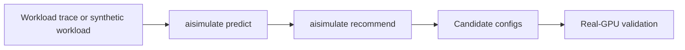

DynoSim is Dynamo's simulation stack for exploring serving configurations before validating them on real clusters. It is not a separate service; it is the product surface that connects workload-driven simulation runs, configuration sweeps, the mocker engine, Planner simulation, Router simulation, and AIC-backed timing models into one workflow.

Use DynoSim when you want to answer questions such as:

- Which aggregated or disaggregated topology should this workload use?
- How many prefill and decode workers fit within my GPU budget?
- How sensitive is the deployment to startup time, queue pressure, prefix reuse, or router tuning?
- Which candidates should I validate with AIPerf on real GPUs?

## Components

| Component | Entry Point | Role |
|---|---|---|
| DynoSim prediction | `aisimulate predict --stack dynamo` | Runs one workload against one simulated Dynamo configuration and emits metrics plus a report |
| DynoSim recommendation | `aisimulate recommend --stack dynamo` | Searches simulation trials across parallelism, worker split, router knobs, service-level objective (SLO) constraints, and GPU budget |
| Live Mocker workers | `python3 -m dynamo.mocker` | Registers simulated workers with the live Dynamo runtime; does not generate replay traffic |
| Public Replay online CLI | Unavailable | Will return through the unified AISimulate CLI in a future release; the Python replay SDK retains online mode |
| Mocker core | `lib/mocker` | Models engine scheduling, KV allocation, prefix caching, preemption, and timing |
| AISimulate performance model | `timing.type: default` in the AISimulate YAML | Supplies calibrated timing and candidate-shape data for supported model/backend/GPU tuples |
| Planner simulation | `planner` in the AISimulate YAML | Runs Planner decisions in the simulation loop to study scaling behavior and SLO compliance |

## How the tools differ

The tools overlap in workflow but perform different jobs:

| Tool | Function | What it does not do |
|---|---|---|
| AIConfigurator | Estimates performance and ranks parallelism and deployment layouts | Does not run the Dynamo request lifecycle or measure a live endpoint |
| Mocker | Simulates engine scheduling, KV-cache state, timing, and worker behavior | Does not execute model inference on GPUs |
| DynoSim | Replays workloads and sweeps configurations using Mocker engine cores | Does not replace final validation on the target deployment |
| AIPerf | Sends load to a live OpenAI-compatible endpoint and measures the result | Does not predict or simulate an undeployed configuration |

With `timing.type: default`, DynoSim uses the performance model shipped by AISimulate to estimate how
long model work takes. Mocker and DynoSim simulate how requests move through scheduling, KV-cache,
routing, and Planner behavior. Set `timing.type` to `fixed` or `polynomial` when calibrated timing is
not required.

## Workflow

Start with `aisimulate predict --stack dynamo` to verify the workload shape and engine configuration.
Use `aisimulate recommend --stack dynamo` to search the design space. Launch live Mocker workers
when an integration test needs the real Dynamo runtime. Validate the shortlist on real GPUs before
production rollout.

## Where AISimulate Fits

AISimulate provides performance models and candidate-shape information. DynoSim uses those models
for default timing and parallelism recommendation. Mocker still owns the scheduler and KV-memory
simulation: batching, prefix-cache hits, preemption, block allocation, and request lifecycle are
simulated by Dynamo's Mocker core, while AISimulate-backed timing predicts how long prefill and
decode work should take for supported model/backend/GPU combinations.

## Choosing an Entry Point

| Goal | Start Here |
|---|---|
| Run one trace or synthetic workload through one config | [Run a DynoSim Simulation](dynosim-replay.mdx) |
| Sweep topology and router choices under SLA/GPU constraints | [Sweep DynoSim Configurations](dynosim-sweeps.mdx) |
| Run live Mocker workers on Kubernetes | [Simulate a Kubernetes Deployment](../../../kubernetes/operations/simulation-with-dynosim/mocker-live-simulation.mdx) |
| Run live Mocker workers locally | [Simulate a Local Deployment](mocker-live-simulation.mdx) |
| Study Planner scaling decisions against a trace | [Benchmark Planner Decisions](../../../kubernetes/operations/simulation-with-dynosim/dynosim-planner-replay.mdx) |
| Generate a deployable Kubernetes config from model/SLA intent | [Auto Deployment](../../../kubernetes/auto-deployment/overview.mdx) |

DynoSim narrows the search space; it does not replace real-hardware validation. Use it to move quickly, find promising candidates, and understand failure modes before spending cluster time.
