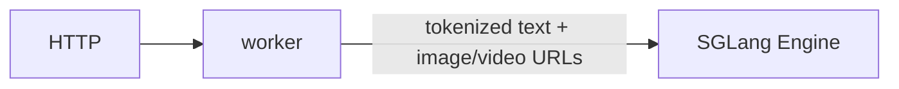
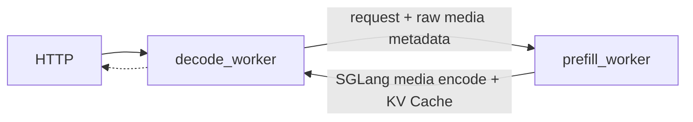
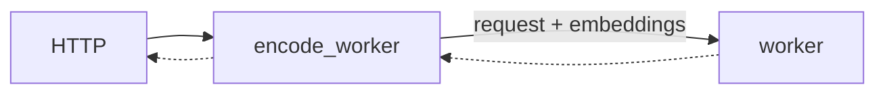
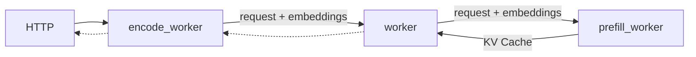

This document provides a comprehensive guide for multimodal inference using SGLang backend in Dynamo. SGLang multimodal supports native **EPD** and **EP/D** flows where the SGLang engine performs media encoding, plus explicit encode-worker **E/PD** and **E/P/D** flows with NIXL (RDMA) for zero-copy tensor transfer.

## Support Matrix

| Modality | Input Format | Aggregated | Disaggregated | Notes |
|----------|--------------|------------|---------------|-------|
| **Image** | HTTP/HTTPS URL | Yes | Yes | Vision encoder generates embeddings |
| **Image** | Data URL (Base64) | No | No |  |
| **Video** | HTTP/HTTPS, `file://`, `data:` | No | Yes, H.264/H.265, Qwen2-family only | Needs the encode worker; decoded on NVDEC, then the vision encoder produces embeddings |
| **Audio** | HTTP/HTTPS URL | No | No | Not supported in SGLang backend |

> [!IMPORTANT]
> **Video input is limited to H.264 and H.265, and requires a separate encode
> worker.** The runtime image ships no software video decoder, so H.264 and H.265
> video is decoded on the GPU by NVDEC. Video in any other format (VP8, VP9, AV1)
> cannot be decoded at all.
>
> "Encode worker" here means Dynamo's `--disaggregation-mode encode` component,
> which runs the model's vision encoder to turn frames into embeddings. It does
> not encode video — nothing in this path produces a video stream. Hardware
> decode is wired into that worker (as used by `multimodal_epd.sh`). In an
> aggregated deployment SGLang resolves and decodes the media URL itself, so
> Dynamo never sees the bytes and cannot route them to NVDEC — video input is
> therefore unavailable in aggregated deployments of this image.
>
> Video is also skipped for model types whose preprocessing cannot accept
> pre-decoded frames (the Qwen3-VL family); those requests fall back to the URL
> path, which has no decoder in this image. Use a Qwen2-family vision model.
>
> NVDEC requires a GPU with a video decode engine and a container granted the
> `video` driver capability — see
> [Video Decode GPU Requirements](../../../../../use-cases/multimodal-serving/video-decode-gpu-requirements.md).
> `file://` sources additionally require `DYN_MM_LOCAL_PATH` to permit local reads.

### Supported URL Formats

| Format | Example | Description |
|--------|---------|-------------|
| **HTTP/HTTPS** | `https://example.com/image.jpg` | Remote media files |
| **file://** | `file:///tmp/test.mp4` | Local files accessible to the backend |

> [!NOTE]
> Media URLs are validated against a default-deny policy. `https://` and `data:` sources
> pass; plain `http://` and hostnames that resolve to private or loopback addresses are
> refused. To fetch media over the cluster's internal network, set
> `DYN_MM_ALLOW_INTERNAL=1` on the worker that loads it.

## Deployment Patterns

SGLang supports EPD, EP/D, E/PD, and E/P/D patterns. See [Multimodal Model Serving](../../../../../use-cases/multimodal-serving/overview.md) for detailed explanations.

| Pattern | Supported | Launch Script | Notes |
|---------|-----------|---------------|-------|
| EPD (Simple Aggregated) | ✅ | `agg_vision.sh` | Internal encoding |
| EP/D or P/D (No Separate Encode Worker) | ✅ | `disagg.sh`, `disagg_same_gpu.sh` | Native SGLang P/D launchers; prefill performs encode + prefill, decode reprocesses raw media metadata for token layout |
| E/PD (Encode Separate) | ✅ | `multimodal_epd.sh` | Vision encoder separate |
| E/P/D (Full Disaggregation) | ✅ | `multimodal_disagg.sh` | KV cache via bootstrap |

### Component Flags

| Component | Flag | Purpose |
|-----------|------|---------|
| Native multimodal worker | `--enable-multimodal` | Allow raw multimodal inputs. In EP/D or P/D this keeps the normal prefill/decode workers; both receive raw media metadata. |
| Encode Worker | `--enable-multimodal --disaggregation-mode encode` | Frontend-facing, vision encoding, embeddings generation (Rust frontend tokenizes) |
| Internal PD Worker | `--enable-multimodal --dedicated-mm-encoder --disaggregation-mode pd` | Prefill + decode worker that consumes embeddings from the encode worker |
| Internal Decode Worker | `--enable-multimodal --dedicated-mm-encoder --disaggregation-mode decode` | Entry point for E/P/D after the encode worker has produced embeddings |
| Internal Prefill Worker | `--enable-multimodal --dedicated-mm-encoder --disaggregation-mode prefill` | Called by internal decode, bootstrap coordination with precomputed embeddings |

> [!WARNING]
> `--dedicated-mm-encoder` is intentionally explicit. Do not infer the internal E/PD or E/P/D worker path from `--enable-multimodal --disaggregation-mode prefill/decode`. Native EP/D or P/D uses those same two disaggregation modes, but it stays on the normal SGLang handlers: prefill processes raw image/video inputs to build vision context, while decode reprocesses the same raw media metadata so token layout matches the transferred KV cache. If the dedicated encoder flag is removed or made implicit, native disaggregated deployments can register only internal topology workers and lose the public OpenAI chat/completions surface.
>
> In SGLang E/P/D, keep this flag on both the decode and prefill workers. This differs from vLLM: SGLang's encode worker delegates generation to `backend.generate`, which is the decode worker, and that decode worker forwards the precomputed multimodal payload to prefill. With this flag, the internal workers consume transferred embeddings instead of raw image/video URLs, avoiding the duplicate raw-media preprocessing used by native EP/D or P/D.

### SGLang-Specific Characteristics

- **Vision Encoder in Python**: Encode worker uses SGLang's MMEncoder for model-agnostic vision encoding
- **Token Expansion**: Single `<|image_pad|>` token replaced with N tokens based on embedding shape
- **NIXL Transfer**: Embeddings transferred from Encoder → PD Worker using NIXL
- **No Rust Processing**: All tokenization and image handling happens in Python

## Multimodal KV Routing

Multimodal KV routing works with SGLang's aggregated worker topology. It is independent of the E/PD and E/P/D encoder-disaggregation patterns described later in this guide.

SGLang RadixAttention includes a per-image `pad_value` token in its prefix-cache key. Dynamo must use that same token in the routing view:

1. The Rust frontend hashes each image and calculates its expanded token count.
2. It derives `pad_value = MM_PAD_SHIFT_VALUE + (mm_hash % 2^30)`.
3. It substitutes that value for the image placeholder in the routing-only token view.
4. It forwards the original hash list through `GenerateReqInput.mm_hashes`.
5. SGLang uses the supplied hash when constructing its own `pad_value`, keeping the router and RadixAttention cache keys aligned.

The frontend selects this behavior automatically when the worker's `ModelDeploymentCard` reports `backend_framework="sglang"`.

Step 4 needs an SGLang build that accepts `mm_hashes`. Dynamo's SGLang image carries the upstream patch that adds it; a custom build without it is still supported, but Dynamo detects the missing argument when the worker starts and routes on the text prefix alone, so image identity no longer contributes to cache overlap.

Launch an aggregated deployment with multimodal KV routing:

```bash
cd $DYNAMO_HOME
bash examples/backends/sglang/launch/agg_multimodal_router.sh
```

The launcher configures KV events on each worker and sets `--router-mode kv` with a matching frontend and worker block size.

| Variable | Default | Purpose |
|----------|---------|---------|
| `MODEL` | `Qwen/Qwen3-VL-2B-Instruct` | Model to serve |
| `NUM_WORKERS` | `2` | Number of SGLang workers |
| `BLOCK_SIZE` | `16` | Worker page size and frontend KV block size |
| `KV_EVENTS_PORT_BASE` | `29090` | Starting port for per-worker KV event publishers |
| `SGLANG_EXTRA_ARGS` | unset | Additional arguments for `python -m dynamo.sglang` |

### Version Requirements

The Dynamo SGLang image includes both routing prerequisites:

- Dynamo is built with the `mm-routing` Rust feature.
- SGLang 0.5.13 or later includes `GenerateReqInput.mm_hashes` support. Dynamo currently pins 0.5.19.

Custom installations on SGLang 0.5.12 or earlier need the `mm_hashes` change
from [sgl-project/sglang#25300](https://github.com/sgl-project/sglang/pull/25300).
Without it, requests still complete but fall back to text-prefix-only routing.
Prefer upgrading to 0.5.13 or later instead of patching an installed package.

Enable `DYN_LOG=info,mm_routing=debug` to inspect image-token counts, multimodal hashes, and the selected worker's overlap. A repeated request should select the same worker with high block overlap.

For the user-facing workflow, see [Multimodal KV Routing](../../../../../use-cases/multimodal-serving/multimodal-kv-routing.md).

## Use the Latest Release

We recommend using the latest stable release of dynamo to avoid breaking changes:

[](https://github.com/ai-dynamo/dynamo/releases/latest)

You can find the [latest release](https://github.com/ai-dynamo/dynamo/releases/latest) and check out the corresponding branch with:

```bash
git checkout $(git describe --tags $(git rev-list --tags --max-count=1))
```

## EPD Serving (Simple Aggregated)

### Components

- worker: [DecodeWorkerHandler](https://github.com/ai-dynamo/dynamo/blob/main/components/src/dynamo/sglang/request_handlers/llm/decode_handler.py) handles encoding, prefilling, and decoding in a single process.

### Workflow

The `DecodeWorkerHandler` receives multimodal requests with image/video URLs and passes them directly to SGLang's engine. SGLang's internal `mm_data_processor` handles image/video fetching, loading, encoding, and token expansion.



### Launch

```bash
cd $DYNAMO_HOME/examples/backends/sglang
./launch/agg_vision.sh --model-path Qwen/Qwen2-VL-7B-Instruct
```

**Client:**

```bash
curl http://localhost:8000/v1/chat/completions \
  -H "Content-Type: application/json" \
  -d '{
    "model": "Qwen/Qwen2.5-VL-7B-Instruct",
    "messages": [
      {
        "role": "user",
        "content": [
          {
            "type": "text",
            "text": "Explain why Roger Federer is considered one of the greatest tennis players of all time"
          },
          {
            "type": "image_url",
            "image_url": {
              "url": "http://images.cocodataset.org/test2017/000000155781.jpg"
            }
          }
        ]
      }
    ],
    "max_tokens": 50,
    "stream": false
  }' | jq
```

Video requests use the same aggregated path:

```bash
curl http://localhost:8000/v1/chat/completions \
  -H "Content-Type: application/json" \
  -d '{
    "model": "Qwen/Qwen2-VL-7B-Instruct",
    "messages": [
      {
        "role": "user",
        "content": [
          {
            "type": "text",
            "text": "Describe the video in detail"
          },
          {
            "type": "video_url",
            "video_url": {
              "url": "https://samplelib.com/mp4/sample-5s.mp4"
            }
          }
        ]
      }
    ],
    "max_tokens": 50,
    "stream": false
  }' | jq
```

## EP/D or P/D Serving (No Separate Encode Worker)

### Components

- workers:
  - [PrefillWorkerHandler](https://github.com/ai-dynamo/dynamo/blob/main/components/src/dynamo/sglang/request_handlers/llm/prefill_handler.py) receives raw multimodal metadata and lets SGLang perform media loading, encoding, token expansion, and KV production during prefill.
  - [DecodeWorkerHandler](https://github.com/ai-dynamo/dynamo/blob/main/components/src/dynamo/sglang/request_handlers/llm/decode_handler.py) receives matching multimodal metadata so token layout stays aligned with the transferred KV cache.

### Workflow

The Rust frontend tokenizes the request and forwards image/video URLs as `multi_modal_data`. There is no encode worker. The prefill worker passes those URLs to SGLang's normal multimodal engine path, so the vision context is produced inside the prefill worker. The decode worker also passes the same URLs to SGLang so the tokenizer manager can reproduce the multimodal token layout while consuming KV cache from prefill.

This native EP/D or P/D path intentionally trades simplicity for duplicated raw-media preprocessing: both prefill and decode call SGLang with `image_data`/`video_data`, so SGLang's multimodal processor may fetch/load/preprocess the same media twice. Use the E/PD or E/P/D encode-worker topology when the deployment must preprocess media once and forward precomputed embeddings.



### Launch

Native P/D and EP/D use the same launchers. The topology is selected by the
model: text-only models run P/D, while VLMs run native EP/D where the prefill
worker performs the media encode step. Neither path has a separate encode
worker.

```bash
cd $DYNAMO_HOME/examples/backends/sglang

# P/D: text-only model, prefill on GPU 0 and decode on GPU 1.
./launch/disagg.sh --model Qwen/Qwen3-0.6B

# EP/D: VLM, same launcher; prefill performs media encoding and decode runs separately.
./launch/disagg.sh --model Qwen/Qwen3-VL-4B-Instruct

# Single-GPU smoke test: same EP/D behavior with prefill and decode packed together.
./launch/disagg_same_gpu.sh --model Qwen/Qwen3-VL-4B-Instruct
```

These launchers pass `--enable-multimodal` to the prefill and decode workers but deliberately do not pass `--dedicated-mm-encoder`.

## E/PD Serving (Encode Separate)

### Components

- workers:
  - [MultimodalEncodeWorkerHandler](https://github.com/ai-dynamo/dynamo/blob/main/components/src/dynamo/sglang/request_handlers/multimodal/encode_worker_handler.py) for image encoding and embeddings generation
  - [MultimodalWorkerHandler](https://github.com/ai-dynamo/dynamo/blob/main/components/src/dynamo/sglang/request_handlers/multimodal/worker_handler.py) for prefilling and decoding.

### Workflow

The Rust frontend tokenizes the request and extracts image URLs into `multi_modal_data`. The `MultimodalEncodeWorker` receives the pre-tokenized request, downloads and encodes the image, and passes the embeddings to the MultimodalWorker. The work complete event is sent via NATS, while the embeddings tensor is transferred via RDMA through the NIXL interface. The `MultimodalWorker` then prefills and decodes the prompt in the same engine, as in the [LLM aggregated serving](overview.md) example. Only the encode worker is registered to the Dynamo frontend as an available endpoint. The PD worker does NOT register - it is an internal component and communicates via NATS.




### Launch

```bash
cd $DYNAMO_HOME/examples/backends/sglang
./launch/multimodal_epd.sh
```

**Client:**

```bash
curl http://localhost:8000/v1/chat/completions \
  -H "Content-Type: application/json" \
  -d '{
    "model": "Qwen/Qwen2.5-VL-7B-Instruct",
    "messages": [
      {
        "role": "user",
        "content": [
          {
            "type": "text",
            "text": "Explain why Roger Federer is considered one of the greatest tennis players of all time"
          },
          {
            "type": "image_url",
            "image_url": {
              "url": "http://images.cocodataset.org/test2017/000000155781.jpg"
            }
          }
        ]
      }
    ],
    "max_tokens": 50,
    "stream": false
  }' | jq
```

## E/P/D Serving (Full Disaggregation)

### Components

- workers:
  - [MultimodalEncodeWorkerHandler](https://github.com/ai-dynamo/dynamo/blob/main/components/src/dynamo/sglang/request_handlers/multimodal/encode_worker_handler.py) for image encoding and embeddings generation
  - [MultimodalWorkerHandler](https://github.com/ai-dynamo/dynamo/blob/main/components/src/dynamo/sglang/request_handlers/multimodal/worker_handler.py) for decoding
  - [MultimodalPrefillWorkerHandler](https://github.com/ai-dynamo/dynamo/blob/main/components/src/dynamo/sglang/request_handlers/multimodal/worker_handler.py) for prefilling

### Workflow

In models like Qwen2.5-VL, embeddings are only required during the prefill stage. The Rust frontend tokenizes and extracts image URLs. The `MultimodalEncodeWorker` receives the pre-tokenized request, encodes images, and transfers embeddings via NIXL to the Decode Worker (the entry point for disaggregation), which then coordinates with the Prefill Worker. The Prefill Worker processes the embeddings and forwards the KV cache back to the Decode Worker for token generation.



### Launch

```bash
cd $DYNAMO_HOME/examples/backends/sglang
./launch/multimodal_disagg.sh
```

**Client:**

```bash
curl http://localhost:8000/v1/chat/completions \
  -H "Content-Type: application/json" \
  -d '{
    "model": "Qwen/Qwen2.5-VL-7B-Instruct",
    "messages": [
      {
        "role": "user",
        "content": [
          {
            "type": "text",
            "text": "Explain why Roger Federer is considered one of the greatest tennis players of all time"
          },
          {
            "type": "image_url",
            "image_url": {
              "url": "http://images.cocodataset.org/test2017/000000155781.jpg"
            }
          }
        ]
      }
    ],
    "max_tokens": 50,
    "stream": false
  }' | jq
```

## Bootstrap Coordination

SGLang disaggregation uses a bootstrap mechanism for P->D coordination:

### Request Flow (Important)

```text
Client → Frontend → Processor → Encode → DECODE Worker → Prefill Worker
                                               ↑
                                    Entry point for disaggregation!
```

### Bootstrap Process

1. **Decode Worker** receives request from Encode Worker
2. **Decode Worker** calls Prefill Worker via NATS to request bootstrap info
3. **Prefill Worker** generates `{host, port, room}` and returns immediately
4. **Both workers** connect to same "room" using bootstrap coordinates
5. **SGLang internally** transfers KV cache state via bootstrap connection (not NIXL)

### Key Difference from vLLM

- vLLM: Frontend → Prefill → Decode (Prefill is entry point)
- SGLang: Frontend → Processor → Encode → **Decode → Prefill** (Decode is entry point)

## Inter-Component Communication

### Control Flow (NATS)

All component-to-component communication happens via NATS:

#### E/PD Mode (Encode Separate)

```text
Processor → Encode Worker → PD Worker
  (NATS)        (NATS + NIXL embeddings)
```

#### E/P/D Mode (Full Disaggregation)

```text
Processor → Encode Worker → DECODE Worker → Prefill Worker
  (NATS)        (NATS)            (NATS)
                             ↓
                    Decode requests bootstrap
                             ↓
                    Prefill returns {host, port, room}
                             ↓
                    Both connect via bootstrap
                             ↓
                    SGLang internal KV cache transfer
```

### Detailed Message Flow

```text
Processor → Encode Worker:
  - NATS round_robin with SglangMultimodalRequest
  - Contains: tokenized input_ids, image URL, sampling params

Encode Worker → Decode/PD Worker:
  - NATS round_robin to "backend" component
  - Contains: expanded token_ids, NIXL metadata, embeddings shape
  - NIXL transfer: embeddings tensor

Decode Worker → Prefill Worker (disagg only):
  - NATS call to "prefill" component
  - Decode requests bootstrap coordinates
  - Prefill returns: {bootstrap_host, bootstrap_port, bootstrap_room}

Prefill ↔ Decode (via bootstrap):
  - SGLang internal connection (not NATS)
  - KV cache state shared via bootstrap mechanism
```

### Data Transfer (NIXL)

NIXL is used only for embedding transfer:

```python
# Encode Worker
descriptor = connect.Descriptor(precomputed_embeddings)
with connector.create_readable(descriptor) as readable:
    request.serialized_request = readable.metadata()
    await pd_worker_client.round_robin(request)
    await readable.wait_for_completion()

# PD Worker
embeddings = torch.empty(request.embeddings_shape, dtype=torch.float16)
descriptor = connect.Descriptor(embeddings)
read_op = await connector.begin_read(request.serialized_request, descriptor)
await read_op.wait_for_completion()
```

## Vision Encoding Details

### Encode Worker Components

The encode worker uses SGLang's `MMEncoder` for model-agnostic vision encoding. `MMEncoder` handles vision model loading, image preprocessing, and feature extraction internally:

```python
from sglang.srt.disaggregation.encode_server import MMEncoder

self.encoder = MMEncoder(
    server_args=config.server_args,
    dist_init_method="tcp://127.0.0.1:0",
    rank=0,
)

# At request time:
image_grid_dim, mm_embedding = await self.encoder._encode([image_url])
```

### Token Expansion Process

1. Processor inserts single image token (e.g., `<|image_pad|>`)
2. Encode worker generates embeddings: `shape = (batch, num_patches, hidden_dim)`
3. Encode worker replaces single token with `num_patches` tokens
4. Downstream worker receives expanded token sequence

Example:

```python
# Before: ["Hello", "<|image_pad|>", "world"]
# After:  ["Hello", "<|image_pad|>", "<|image_pad|>", ...(576 tokens), "world"]
```

## Chat Template Processing

SGLang uses its own chat template system:

```python
from sglang.srt.parser.conversation import chat_templates

conv = chat_templates["qwen2-vl"].copy()
conv.append_message(conv.roles[0], f"{conv.image_token} Describe this image")
processed = tokenizer(text=conv.get_prompt(), return_tensors="pt")
```

Supported templates: `qwen2-vl`, `llama-3`, `vicuna`, etc.

## NIXL Usage

| Use Case | NIXL Used? | Data Transfer | Notes |
|----------|------------|---------------|-------|
| EPD (Simple Aggregated) | No | N/A | All processing internal to SGLang |
| EP/D or P/D (No Separate Encode Worker) | No | Prefill → Decode (KV cache via bootstrap) | Prefill performs SGLang media encoding inline |
| E/PD (Encode Separate) | Yes | Encoder → PD (embeddings) | Vision encoder separate |
| E/P/D (Full Disaggregation) | Yes | Encoder → Prefill (embeddings) | KV cache via SGLang bootstrap |

**Key Difference:** SGLang native EP/D or P/D uses bootstrap mechanism, not NIXL for KV cache like vLLM.

## Environment Variables

### `SGLANG_ENCODER_MM_LOAD_WORKERS`

Controls how many threads the encoder uses to fetch and load images concurrently. When a request contains multiple images (URLs, file paths, or base64 data), each image is loaded in a separate thread. Default is 4. Increase if image loading (network fetch or disk I/O) is the bottleneck rather than GPU compute. Has no effect if the vision encoder itself is the bottleneck, since encoding is sequential on GPU after all images are loaded.

```bash
# Example: allow up to 16 concurrent image loads per encoder
export SGLANG_ENCODER_MM_LOAD_WORKERS=16
```

Only applies to the EPD encode worker (which uses [SGLang's MMEncoder](https://github.com/sgl-project/sglang/blob/v0.5.19/python/sglang/srt/disaggregation/encoder/server.py) internally).

## Profiling

Dynamo's SGLang multimodal workers include NVTX markers for `nsys` profiling. They are disabled by default (zero overhead) and enabled by setting `DYN_NVTX=1`.

```bash
cd $DYNAMO_HOME/examples/backends/sglang
DYN_NVTX=1 nsys profile --trace=cuda,nvtx -o profile.nsys-rep \
  bash launch/multimodal_epd.sh ...
```

| ENV Variable | Default | Description |
|---|---|---|
| `DYN_NVTX` | `0` | Set to `1` to enable NVTX range/mark annotations in multimodal encode/prefill/decode worker paths for `nsys` profiling |

Key NVTX ranges emitted:

| Range | Worker | Description |
|-------|--------|-------------|
| `mm:enc:generate` | Encode | Full encode request lifetime |
| `mm:enc:vision_encode` | Encode | Vision encode call (`MMEncoder._encode`) |
| `mm:enc:embedding_transfer` | Encode | Embedding handoff to downstream worker |
| `mm:nixl:begin_read` | PD (agg) / Prefill | Begin NIXL read operation for embeddings |
| `mm:nixl:wait_completion` | PD (agg) / Prefill | Wait for NIXL embedding transfer completion |
| `mm:pd:generate` | Aggregated worker / Decode worker (`MultimodalWorkerHandler`) | Full worker-side request lifetime |
| `mm:pd:generate_agg` | PD (agg) | Aggregated generation path |
| `mm:pd:load_multimodal` | PD (agg) | Build multimodal items from transferred embeddings |
| `mm:pd:generate_disagg` | Decode worker (disagg entrypoint) | Disaggregated generation path |
| `mm:prefill:bootstrap` | Prefill (disagg) | Bootstrap coordination path before returning `{bootstrap_host, bootstrap_port, bootstrap_room}` |
| `mm:prefill:load_multimodal` | Prefill (disagg) | Build multimodal items from transferred embeddings in the prefill worker |
| `mm:prefill:engine_async_generate` | Prefill (disagg) | SGLang prefill engine invocation (`engine.async_generate`) |
| `mm:pd:ttft` | Aggregated worker / Decode worker (`MultimodalWorkerHandler`) | Worker-entry TTFT: from request arrival at this worker to first output token (excludes client->frontend->worker network transit) |
| `mm:dec:first_token` | Aggregated worker / Decode worker (`MultimodalWorkerHandler`) | Decode-stage first-token range (starts when decode stream is launched; not worker-entry TTFT) |

## Known Limitations

- **No Data URL support** - Only HTTP/HTTPS URLs supported; `data:image/...` base64 URLs not supported
- **No pre-computed embeddings** - Cannot use `.pt`, `.pth`, `.bin` embedding files; vision encoder runs for every request
- **No audio support** - No audio encoder implementation
- **Only Processor registers with Dynamo** - Workers are internal components, frontend routes to Processor only
- **Disaggregated routing** - Decode Worker is the entry point (calls Prefill), cannot route directly to Prefill workers
- **Limited model generalization** - Token expansion logic is model-specific; adding new models may require implementation updates

## Supported Models

SGLang multimodal **only supports image-based vision-language models**:

- **Qwen2-VL** / **Qwen2.5-VL** - `Qwen/Qwen2.5-VL-7B-Instruct`
- **Qwen3-VL** - `Qwen/Qwen3-VL-30B-A3B-Instruct`
- Models supported by SGLang's MMEncoder

## Key Files

| File | Description |
|------|-------------|
| `components/src/dynamo/sglang/main.py` | Component initialization, Encode Worker registers |
| `components/src/dynamo/sglang/request_handlers/multimodal/encode_worker_handler.py` | Frontend-facing: vision encoding, embeddings generation (receives pre-tokenized input) |
| `components/src/dynamo/sglang/request_handlers/multimodal/worker_handler.py` | PD/Prefill/Decode workers, NIXL read |
| `components/src/dynamo/sglang/protocol.py` | Request/response data structures |
| `components/src/dynamo/sglang/register.py` | Registration logic (called for Encode Worker) |
