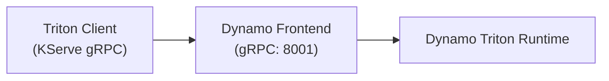

Dynamo Triton integrates [NVIDIA Triton Inference Server](https://github.com/triton-inference-server/server) into Dynamo's distributed runtime.
Triton models — across its full backend ecosystem (TensorRT, ONNX Runtime, PyTorch, Python, DALI, ...) — are served through Dynamo's frontend over the [KServe gRPC protocol](https://kserve.github.io/website/latest/modelserving/data_plane/v2_protocol/), gaining Dynamo's service discovery and routing.

The runtime is composed exactly like the vLLM / SGLang / TRT-LLM runtimes: the Dynamo wheels are installed on top of the upstream Triton release image (`nvcr.io/nvidia/tritonserver:<tag>`).
That image is the build's `RUNTIME_IMAGE`, so the result is a single "Dynamo + Triton" artifact.

## Feature Support Matrix

### Core Dynamo Features

| Feature                                        | Status  | Notes                                                           |
| :--------------------------------------------- | :-----: | :-------------------------------------------------------------- |
| Tensor (KServe gRPC) Serving                   |  Ready  | Multiple models per worker                                      |
| Service Discovery / Routing                    |  Ready  | Via the Dynamo Frontend                                         |
| Triton backends (TensorRT, ONNX, PyTorch, ...) |  Ready  | Whatever the Triton release image ships                         |
| TensorRT Plugins                               |  Ready  | Via `--backend-config='tensorrt,plugins=...'`                   |
| Routing                                        | Round-Robin only | KV-aware routing is LLM-oriented; tensor models use round-robin |
| Disaggregated Serving                          |   N/A   | Not applicable to generic tensor models                         |

## Known limitations

The KServe gRPC tensor path is still being completed.
The Triton and KServe features below are not yet supported end-to-end through the Dynamo Frontend.

| Limitation                             | Effect                                                                                                                                                                                                                                              |
| :------------------------------------- | :-------------------------------------------------------------------------------------------------------------------------------------------------------------------------------------------------------------------------------------------------- |
| Classification (`class_count` / top-K) | The KServe requested-output `classification` parameter is dropped, so models return raw output logits instead of the top-K `"<score>:<index>:<label>"` class strings. `NvCreateTensorRequest` does not carry requested outputs or their parameters. |
| Model version selection                | Dynamo routes by model name only (`triton.tritonserver.<model_name>`) with no version concept, so version-specific requests are served by the model's default version.                                                                              |
| Shared-memory tensor I/O               | System / CUDA shared-memory inputs and outputs are unsupported — the frontend does not expose the KServe shared-memory region control RPCs. Send tensors inline.                                                                                    |

> [!IMPORTANT]
> **Discovery backend at scale.**
> The `file` discovery backend suits small repositories and the examples below for simple quickstarts.
> A worker that registers a large repository (hundreds of models) in a single burst overflows the file watcher's channels and can tear the frontend down before it reports ready.
> Use the `etcd` discovery backend (`--discovery-backend=etcd`, with etcd running) for large repositories on baremetal. On Kubernetes, native k8s discovery will be used by default.

## Container / driver matrix

| Triton release tag                      |  CUDA  | NVIDIA driver |
| :-------------------------------------- | :----: | :-----------: |
| `nvcr.io/nvidia/tritonserver:26.07-py3` | `13.2` |  `610.43.02`  | <!-- Update version with each Triton release. -->

The Triton release is pinned in [`container/context.yaml`](https://github.com/ai-dynamo/dynamo/tree/main/container/context.yaml) under `triton.cuda13.2` (`runtime_image_tag`/`base_image_tag`), the same way the other framework runtimes pin their image.

## Prerequisites

- An NVIDIA GPU with a driver matching the Triton release in the table above.
- Docker with the NVIDIA Container Toolkit.

## Quick Start (prebuilt / release container)

**Step 1 — build the release image** (source-built Dynamo wheels on the latest Triton release):

```bash
python container/render.py --framework=triton --target=runtime --output-short-filename
docker buildx build --network=host -f container/rendered.Dockerfile -t dynamo:triton-latest .
```

The `ai-dynamo` wheels are built from source and installed on top of the Triton release image, so the running Dynamo matches this repository.
`--network=host` is required at build time to fetch their Python dependencies from PyPI.

**Step 2 — run the container:**

```bash
./container/run.sh --framework triton --image dynamo:triton-latest --workdir /workspace/components/src/dynamo/triton -it
```

Add `-v /path/to/models:/models` to mount your own model repository.

**Step 3 — start the frontend and worker (inside the container):**

Mirroring the other Dynamo runtimes, run the frontend and the Triton worker as two processes that find each other over file-based discovery (no etcd/NATS required).
Triton serves *tensor* models, so the frontend exposes the KServe gRPC endpoint (`--kserve-grpc-server`) rather than the OpenAI HTTP API:

```bash
# Frontend (KServe gRPC on the HTTP port, :8001 to match Triton's gRPC port)
python3 -m dynamo.frontend --kserve-grpc-server --http-port=8001 --discovery-backend=file &

# Triton worker (serves every model in the repo; here the bundled identity sample)
python3 -m dynamo.triton --discovery-backend=file &
```

The worker exposes the full `triton_runtime.Options` surface as flags, named to match Triton's `tritonserver` CLI — run `python3 -m dynamo.triton --help` for the complete list.
The in-process Triton server finds its backends via the image's `LD_LIBRARY_PATH` and the worker's default backend directory (`/opt/tritonserver/backends`), so no extra environment setup is needed.

**Step 4 — send a request:**

Tensor models use the KServe gRPC protocol, so requests go through the bundled gRPC client rather than `curl`.
Point the client at the frontend's port — `client.py` defaults to `8787`, while the frontend above listens on `8001`, matching the `tritonserver` convention:

```bash
python3 client.py --port=8001 --model=identity --shape 1 10
```

## Worker configuration

The worker exposes the full `triton_runtime.Options` surface as CLI flags, named to match Triton's `tritonserver` CLI.
Run `python3 -m dynamo.triton --help` for the complete list.
Common flags:

| Option                          | Description                                                                                                                                                 |
| :------------------------------ | :---------------------------------------------------------------------------------------------------------------------------------------------------------- |
| `--model-repository <path>`     | Model repository to serve (default: `/models`)                                                                                                              |
| `--backend-directory <path>`    | Triton backends directory (default: `/opt/tritonserver/backends`)                                                                                           |
| `--backend-config <cfg>`        | Triton backend config, repeatable, e.g. `--backend-config='tensorrt,plugins=/path/lib.so'`                                                                  |
| `--log-verbose <int>`           | Triton verbose logging level; `0` disables, `>= 1` enables (default: `0`)                                                                                   |
| `--discovery-backend <backend>` | Service discovery backend: `kubernetes`, `etcd`, `file`, `mem` (default: `etcd`)                                                                            |

### Environment variables

| Variable                | Description                                                                                    | Default                 |
| :---------------------- | :--------------------------------------------------------------------------------------------- | :---------------------- |
| `DYN_DISCOVERY_BACKEND` | Discovery backend: `kubernetes`, `etcd`, `file`, or `mem`                                      | `etcd`                  |
| `DYN_LOG`               | Log level (debug, info, warn, error)                                                           | `info`                  |
| `DYN_HTTP_PORT`         | Frontend HTTP port (serves KServe gRPC); this example uses `8001` to match Triton's gRPC port  | `8000`                  |
| `ETCD_ENDPOINTS`        | etcd connection URL (only when `--discovery-backend=etcd`)                                     | `http://localhost:2379` |
| `NATS_SERVER`           | NATS connection URL (only for distributed mode)                                                | `nats://localhost:4222` |
| `DYN_SYSTEM_PORT`       | System metrics/health port, serving the worker's `/metrics` endpoint (see [Metrics](#metrics)) | `-1` (disabled)         |

## Adding your own models

1. Create a model directory in your repository:

   ```text
   model_repo/
   └── my_model/
       ├── config.pbtxt
       └── 1/
           └── model.plan  # or other model file
   ```

2. Define the model config (`config.pbtxt`):

   ```protobuf
   name: "my_model"
   backend: "tensorrt"  # or onnxruntime, python, etc.
   max_batch_size: 8

   input [
     {
       name: "input"
       data_type: TYPE_FP32
       dims: [3, 224, 224]
     }
   ]
   output [
     {
       name: "output"
       data_type: TYPE_FP32
       dims: [1000]
     }
   ]
   ```

3. Launch the worker against your repository.
   With the default `NONE` mode it serves every model in the repository (`--backend-config` matches Triton's syntax):

   ```bash
   python3 -m dynamo.triton \
     --backend-config='tensorrt,plugins=/models/plugins/libmy_plugin.so' \
     --discovery-backend=file &
   ```

## Configuring the Triton version

The Triton release is pinned by `triton.cuda13.2.runtime_image_tag` in [`container/context.yaml`](https://github.com/ai-dynamo/dynamo/tree/main/container/context.yaml) (default `26.07-py3`), mirroring how the other framework runtimes pin their image.
The CUDA family is fixed by the Triton release, so `--cuda-version` is auto-derived; passing it explicitly is rejected.

To build into a different Triton release, override `RUNTIME_IMAGE_TAG` at build time (no `context.yaml` edit needed). Keep `BASE_IMAGE_TAG` on CUDA 13.1 (default `26.02-cuda13.1-devel-ubuntu24.04`):
the Rust `cudarc` crate rejects CUDA 13.2 at build time, and the wheels load CUDA dynamically so they run on the 13.2 runtime image regardless:

```bash
python container/render.py --framework=triton --target=runtime --output-short-filename
docker buildx build --network=host \
  --build-arg RUNTIME_IMAGE_TAG=26.07-py3 \
  --build-arg BASE_IMAGE_TAG=26.02-cuda13.1-devel-ubuntu24.04 \
  -f container/rendered.Dockerfile -t dynamo:triton-26.07 .
```

To make a release the default, edit `triton.cuda13.2` in `container/context.yaml`.

## Metrics

Triton metric collection is enabled by default (`--allow-metrics`).
The worker serves Triton's native `nv_*` metrics from Dynamo's `/metrics` endpoint alongside the `dynamo_*` metrics; set `DYN_SYSTEM_PORT` to expose that endpoint:

```bash
DYN_SYSTEM_PORT=8002 python3 -m dynamo.triton --discovery-backend=file &

curl -s http://localhost:8002/metrics
```

The `nv_*` metrics are collected on each scrape of `/metrics`.
Pass `--allow-metrics=false` to stop collection and exclude them from the endpoint.

## Troubleshooting

### "Model not found" error

- Verify the model exists in `/models/<model_name>/`.
- Check that `config.pbtxt` is valid.
- Ensure the backend is available in the backend directory (`/opt/tritonserver/backends`).

### Worker fails to start

- Verify GPU is available: `nvidia-smi`.
- Confirm the model repository path is mounted into the container.
- Increase log verbosity: `--log-verbose=1` (or higher for more detail).

## How it works



The worker ([`components/src/dynamo/triton/main.py`](https://github.com/ai-dynamo/dynamo/tree/main/components/src/dynamo/triton/main.py)):
1. Starts an in-process server object
2. Loads all models from the model repository
3. Reads each model's configuration (`config.pbtxt`)
4. Registers each model with the Dynamo runtime as a tensor-based model (`ModelInput.Tensor` / `ModelType.TensorBased`).
5. Requests sent to the Dynamo Frontend hosted KServe gRPC endpoint are converted to Triton inference requests and the responses are streamed back as Dynamo tensors.
   Each model is served on its own endpoint (`triton.<model_name>`), so a single worker can serve multiple models routed by name.
