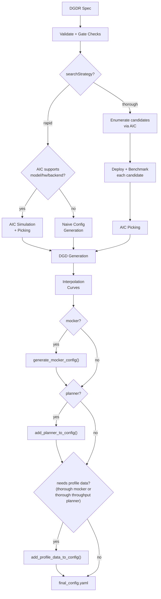

## Overview

The Dynamo Profiler analyzes model inference performance and generates optimized deployment configurations (DynamoGraphDeployments). Given a model, hardware, and SLA targets, it determines the best parallelization strategy, selects optimal prefill and decode engine configurations, and produces a ready-to-deploy DGD YAML.

The profiler accepts a `DynamoGraphDeploymentRequestSpec` (DGDR) as input and uses [AIConfigurator (AIC)](../../../additional-resources/aiconfigurator-reference.md) compatibility APIs from the `aisimulate` wheel for performance simulation, candidate enumeration, and configuration picking. When the Planner is enabled, the profiler also emits the native AIC model identity and can generate optional engine interpolation curves used to bootstrap runtime autoscaling.

## Workflow

- **What** model you want to deploy (`model`)
- **How** it should perform (SLA targets: `sla.ttft`, `sla.itl`)
- **Where** it should run (optional GPU preferences via `hardware`)
- **Which** backend to use (`backend`: auto, vllm, sglang, or trtllm)
- **Which** image to use (`image`)

The profiler follows this pipeline:



### Stage-by-stage walkthrough

1. **Validation**: The DGDR spec is validated — required fields checked (`image`, `hardware.gpuSku`, `hardware.numGpusPerNode`), SLA targets verified, and gate checks applied (see [Gate Checks](#gate-checks-and-constraints)).

2. **Search Strategy**: The profiler branches based on `searchStrategy`:
   - **Rapid**: Uses AIC simulation to estimate performance across parallelization configs. No GPUs needed, completes in ~30 seconds.
   - **Thorough**: Enumerates candidate parallelization configs via AIC, deploys each on real GPUs, benchmarks with AIPerf, then picks the best. Takes 2-4 hours, disagg mode only.

3. **Picking**: The profiler selects the best configuration using one of three modes, determined automatically from the DGDR spec (see [Picking Modes](#picking-modes)).

4. **DGD Generation**: The picked configuration is rendered into a complete DGD YAML via AIC's generator pipeline, including correct parallelization, replica counts, container image, and PVC mounts.

5. **Interpolation** (planner bootstrap/mocker): When mocker or planner bootstrap data is requested, the profiler generates detailed performance interpolation curves — TTFT vs ISL for prefill, ITL vs KV-cache utilization for decode. In thorough sweeping, these are stored as NPZ files and later packaged into a ConfigMap during final assembly. In rapid sweeping, consumers use AIC performance-model flags, planner `aic_perf_model`, or in-process interpolation instead, so no profile-data ConfigMap is generated.

6. **Final Assembly** (3 composable layers):
   1. **Mocker base**: If mocker is enabled, the base DGD is swapped for the mocker DGD template (`generate_mocker_config`). Otherwise the AIC-picked DGD is kept.
   2. **Planner service**: If the planner is enabled, the Planner pod and its planner-config ConfigMap are injected into the DGD (`add_planner_to_config`).
   3. **Profile data**: In thorough sweeping, if mocker is enabled or planner throughput-based scaling is enabled, the interpolation data ConfigMap is created and mounted into all consumers — the Planner service and/or mocker workers (`add_profile_data_to_config`). Rapid sweeping does not create this ConfigMap.

   The result is written to `final_config.yaml`.

## Search Strategies

### Rapid

Uses AIC's performance simulation to estimate optimal configurations without
deploying real engines. Completes in ~30 seconds; see the
[AIC support matrix](https://ai-dynamo.github.io/aiconfigurator/support-matrix/).

```yaml
searchStrategy: rapid
```

- Supports all backends: vLLM, SGLang, TensorRT-LLM
- Falls back to a naive config (memory-fit TP calculation) only after DGDR
  accepts the GPU SKU. Fallback sizing depends on AIC system metadata and does
  not add support for additional GPU SKUs.
- No GPU resources consumed during profiling

### Thorough

Enumerates candidate parallelization configs, deploys each as a real K8s workload, and benchmarks with AIPerf.

```yaml
searchStrategy: thorough
```

- Only disaggregated mode is supported
- Does not support `auto` backend — specify `vllm`, `sglang`, or `trtllm`
- Takes 2-4 hours depending on the number of candidates
- Provides highest accuracy since measurements come from real hardware

## Picking Modes

The profiler automatically selects a picking mode based on the DGDR spec:

### Autoscale

Triggered when the **planner is enabled** (scaling enabled in `features.planner`). Picks prefill and decode engines independently, each with 1 replica. The planner handles scaling at runtime.

### Load Match

Triggered when a **target load** is specified (`workload.requestRate` or `workload.concurrency`). Finds the configuration that serves the target load with the minimum number of GPUs under SLA.

```yaml
workload:
  requestRate: 5.0   # target 5 req/s
```

### Default

Triggered when there is **no planner and no target load**. Maximizes throughput for the available GPU budget under SLA.

## Planner Integration

When the Planner is enabled, the profiler emits the `aic_perf_model` identity used by the Planner's AIConfigurator compatibility integration in the `aisimulate` wheel whenever picked configs are available. The `pre_deployment_sweeping_mode` field controls optional bootstrap data:

```yaml
features:
  planner:
    optimization_target: sla              # required for throughput-based scaling and specific SLA targets
    pre_deployment_sweeping_mode: rapid   # rapid | thorough | none
    enable_throughput_scaling: true
```

`optimization_target` must be set to `sla` for `enable_throughput_scaling` and the planner's `ttft_ms`/`itl_ms` SLA targets to take effect. The `PlannerConfig` default is `throughput`, which uses static queue/utilization thresholds: it silently flips `enable_throughput_scaling` to `false` (so pre-deployment profiling is skipped and `planner-profile-data-XXXX` is not emitted) and ignores any `features.planner.ttft_ms`/`itl_ms` values. `enable_load_scaling` is unaffected (easy-mode keeps load scaling enabled). See the [Planner Guide](../planner/planner-guide.md#optimization-target) for the full explanation of each `optimization_target` value.

- **rapid**: Uses AIC simulation to generate interpolation curves (~30s, no GPUs). Consumers use AIC performance-model flags, planner `aic_perf_model`, or in-process interpolation, so `planner-profile-data-XXXX` is not emitted.
- **thorough**: Deploys the selected engine config on real GPUs and sweeps across ISL/concurrency ranges (2-4h). When profile data is needed, the profiler packages it into `planner-profile-data-XXXX`.
- **none**: Skips interpolation. Planner throughput scaling can still start from native AIC or live FPM regression warmup. Mocker still requires pre-deployment sweeping.

The generated DGD can include these ConfigMaps:
- **planner-config-XXXX**: Serialized `PlannerConfig` JSON (with `aic_perf_model` when available and `profile_results_dir` pointing to the profiling data mount)
- **planner-profile-data-XXXX**: Prefill and decode interpolation data (JSON). Only emitted when `pre_deployment_sweeping_mode: thorough` and either `optimization_target: sla` is set alongside `enable_throughput_scaling: true`, or mocker is enabled. Rapid mode does not emit this ConfigMap.

See the [Planner Guide](../planner/planner-guide.md) for the full `PlannerConfig` reference.

## Mocker

When `features.mocker.enabled: true`, the profiler outputs a mocker DGD that simulates engine behavior without real GPUs. This is useful for testing planner behavior and validating configurations at scale.

Mocker requires pre-deployment sweeping to generate simulated performance profiles — `pre_deployment_sweeping_mode` cannot be `none` when mocker is enabled.

## Gate Checks and Constraints

The profiler enforces these rules at startup:

| Condition | Behavior |
|-----------|----------|
| `searchStrategy: thorough` + `backend: auto` | Rejected. Specify a concrete backend. |
| `enable_throughput_scaling: true` without `optimization_target: sla` | Silently coerced. `PlannerConfig` defaults `optimization_target` to `throughput`, which flips `enable_throughput_scaling` to `false` at validation time. Set `optimization_target: sla` explicitly to keep throughput-based scaling enabled. |
| `enable_throughput_scaling: true` + `pre_deployment_sweeping_mode: none` (or unset) | Allowed for planner. The perf model starts from native AIC when available or waits for enough live FPM observations. |
| `enable_throughput_scaling: true` + `pre_deployment_sweeping_mode: rapid` + AIC unsupported | Allowed for Planner. The AIC core model falls back to observed-FPM regression when native AIC estimates are unavailable. |
| `e2eLatency` provided together with an explicitly-set `ttft` or `itl` | Rejected by SLA validator. Provide only `e2eLatency`; `ttft` and `itl` do not need to be explicitly nulled. |
| All AIC rapid experiments return no SLA-feasible configuration | Profiling fails and no DGD is generated. SLA targets are not relaxed automatically. |
| A real-GPU thorough sweep returns results, but none meet the SLA | Warning logged and the closest measured configuration is selected. |
| Load-match needs more GPUs than available | Warning logged. |

## Support Matrix

Check the [AIConfigurator support matrix](https://ai-dynamo.github.io/aiconfigurator/support-matrix/)
for current model, GPU, backend, generator, and performance-model coverage. The tables below summarize
the Profiler's backend and parallelization support.

| Backend | Dense Models | MoE Models |
|---------|-------------|------------|
| vLLM | ✅ | 🚧 |
| SGLang | ✅ | ✅ |
| TensorRT-LLM | ✅ | 🚧 |

The profiler sweeps over the following parallelization mappings for prefill and decode:

| Model Architecture | Prefill Parallelization Mapping | Decode Parallelization Mapping |
|---------|-------------|------------|
| MLA+MoE (DeepseekV3ForCausalLM, DeepseekV32ForCausalLM) | TEP, DEP | TEP, DEP |
| GQA+MoE (Qwen3MoeForCausalLM) | TP, TEP, DEP | TP, TEP, DEP |
| Other Models | TP | TP |

> [!NOTE]
> Exact model x parallelization mapping support is dependent on the backend. The profiler does not guarantee that the recommended P/D engine configuration is supported and bug-free by the backend.

## Deployment

### Kubernetes Deployment (DGDR)

The recommended deployment method is through DGDRs. See [Profiler Examples](profiler-examples.md) for complete DGDR YAML examples covering rapid, thorough, MoE, custom SLA, and override use cases.

#### Container Images

The DGDR `image` field selects the container image for the profiling job. The
image must contain the profiler code and dependencies. If `image` is omitted,
the operator defaults it to
`nvcr.io/nvidia/ai-dynamo/dynamo-planner:<operatorVersion>`.

```yaml
spec:
  image: "nvcr.io/nvidia/ai-dynamo/dynamo-planner:1.4.0"  # dynamo-frontend for Dynamo < 1.1.0
```

> [!NOTE]
> The DGDR-level `spec.runtimeVersionOverride` supplies a default for generated
> DGD components. The operator applies it after processing profiler output and
> DGD overrides only when a component does not already set an explicit value,
> including when a profiler based on Dynamo 1.3.0 or earlier discards the field
> while parsing the DGDR. Set the override when the effective generated runtime
> images do not use tags that identify their Dynamo runtime versions.
> The profiler also applies the field when its output is consumed directly,
> outside the operator-managed DGDR workflow. For DGDR-managed deployments, an
> explicit component value in `spec.overrides.dgd` takes precedence over the
> DGDR-level default.
>
> [Profiler Image Version Compatibility](../../../../reference/kubernetes-api/dynamo-graph-deployment-request.mdx#profiler-image-version-compatibility)
> for details.

#### Quick Start: Deploy with DGDR

**Step 1: Create Your DGDR**

Use a sample configuration or create your own:

```yaml
apiVersion: nvidia.com/v1beta1
kind: DynamoGraphDeploymentRequest
metadata:
  name: my-model-profiling
spec:
  model: "Qwen/Qwen3-0.6B"
  backend: vllm
  image: "nvcr.io/nvidia/ai-dynamo/dynamo-planner:1.4.0"  # dynamo-frontend for Dynamo < 1.1.0
```

**Step 2: Apply the DGDR**

```bash
export NAMESPACE=your-namespace
kubectl apply -f my-profiling-dgdr.yaml -n $NAMESPACE
```

**Step 3: Monitor Progress**

```bash
# View status
kubectl get dgdr -n $NAMESPACE

# Detailed status
kubectl describe dgdr my-model-profiling -n $NAMESPACE

# Watch profiling job logs
kubectl logs -f job/profile-my-model-profiling -n $NAMESPACE
```

**DGDR Status Phases:**
- `Pending`: Initial state, preparing to profile
- `Profiling`: Running profiling job (20-30 seconds for AIC, 2-4 hours for online)
- `Ready`: Profiling complete, generated DGD spec available in status
- `Deploying`: Generating and applying DGD configuration
- `Deployed`: DGD successfully deployed and running
- `Failed`: Error occurred (check events for details)

**Step 4: Access Your Deployment**

```bash
# Find the frontend service
kubectl get svc -n $NAMESPACE | grep frontend

# Port-forward to access locally
kubectl port-forward svc/<deployment>-frontend 8000:8000 -n $NAMESPACE

# Test the endpoint
curl http://localhost:8000/v1/models
```

> [!NOTE]
> DGDRs are **immutable**. To update SLAs or configuration, delete the existing DGDR and create a new one.

### Local Runs with DGD Overrides

The operator supplies `dgd-apply-overrides` to Kubernetes profiling jobs when
`overrides.dgd` is present. For a local run, put the matching binary on `PATH`.
From a Dynamo checkout with Go installed, build and install it with:

```bash
go -C deploy/operator install ./cmd/dgd-apply-overrides
python -m dynamo.profiler --config /path/to/dgdr-spec.yaml
```

`go install` writes the binary to `GOBIN`, or to `$(go env GOPATH)/bin` when
`GOBIN` is unset. Add that directory to `PATH` if needed. Alternatively, set
`DYNAMO_DGD_APPLY_OVERRIDES_BIN` to the binary's absolute path. The profiler
does not download the binary at runtime. Runs without `overrides.dgd` do not
require the helper.

Use a binary from the same Dynamo release as the profiler. The profiler checks
the binary protocol before applying an override and rejects incompatible versions.
For supported DGD versions and merge behavior, see
[Generated DGD Overrides](../../../../kubernetes/auto-deployment/auto-deploy-with-dgdr.md#generated-dgd-overrides).

Registry credentials are namespace-scoped. The operator chart's
`imagePullSecrets` pull the operator Pod only. A profiling Job that needs
credentials for the operator image must receive them from its ServiceAccount or
from `overrides.profilingJob.template.spec.imagePullSecrets` in the DGDR namespace.

## Profiling Method

The profiler follows a 5-step process:

1. **Hardware Setup**: Uses defaults or user-specified hardware configuration. Optionally, cluster-scoped operators can enable automatic GPU discovery to detect specifications from cluster nodes.
2. **Identify Sweep Ranges**: Automatically determine minimum and maximum number of GPUs per engine. Minimum is determined by the model size and GPU VRAM. Maximum is set to one node for dense models and 4 nodes for MoE models.
3. **Parallelization Mapping Sweep**: Test performance of engines with different parallelization mappings using the input ISL and OSL.
   - For dense models, test different TP sizes for both prefill and decode.
   - For MoE models (SGLang), evaluate both TEP and DEP as candidates for prefill and decode.
   - **Prefill**:
     - TP/TEP: Measure TTFT with batch size = 1 (assuming ISL is long enough to saturate compute) without KV reuse.
     - DEP: Attention uses data parallelism. Send a single burst with total concurrency `attention_dp_size × attn_dp_num_req_ratio` (defaults to 4) and compute the reported TTFT as `time_to_first_token.max / attn_dp_num_req_ratio` from the AIPerf summary of that burst.
   
   - **Decode**: Measure the ITL under different numbers of in-flight requests, from 1 to the maximum the KV cache can hold. To measure ITL without being affected by piggy-backed prefill requests, the script enables KV-reuse and warms up the engine by issuing the same prompts before measuring.
   
4. **Recommendation**: Select optimal parallelization mapping for prefill and decode that achieves the highest per-GPU throughput while adhering to the SLA on TTFT and ITL.
5. **In-Depth Profiling on the Recommended P/D Engine**: Interpolate TTFT with ISL and ITL with active KV cache and decode context length for more accurate performance estimation.

   - **Prefill**: Measures TTFT and throughput per GPU across different input lengths with batch size=1.
   - **Decode**: Measures ITL and throughput per GPU under various KV cache loads and decode context lengths.

### AIPerf on Real Engines

Profiles your model by creating real test deployments in Kubernetes and measuring their performance.

- **Duration**: 2-4 hours
- **Accuracy**: Highest (real measurements)
- **GPU Requirements**: Full access to test different parallelization mappings
- **Backends**: vLLM, SGLang, TensorRT-LLM

AIPerf-based profiling is the opt-in thorough strategy. Use
`searchStrategy: thorough` for comprehensive real-engine profiling:

```yaml
spec:
  searchStrategy: thorough  # Deep exploration with real engine profiling
```

### AIConfigurator Simulation

Uses performance simulation to rapidly estimate optimal configurations without running real deployments.

- **Duration**: 20-30 seconds
- **Accuracy**: Estimated (may have errors for unusual configurations)
- **GPU Requirements**: None
- **Backends**: All (vLLM, SGLang, TensorRT-LLM)

AIConfigurator is used by default with `searchStrategy: rapid`:

```yaml
spec:
  searchStrategy: rapid  # Fast profiling with AIConfigurator simulation (default)
```

> [!NOTE]
> `aicBackendVersion` specifies the TensorRT-LLM version that AIConfigurator simulates. See the [AIConfigurator compatibility support matrix](https://ai-dynamo.github.io/aiconfigurator/support-matrix/) for available versions.

**Currently supports:**
- **Backends**: vLLM, SGLang, TensorRT-LLM
- **Systems**: H100 SXM, H200 SXM, B200 SXM, GB200 SXM, A100 SXM
- **Models**: Wide range including GPT, Llama, Mixtral, DeepSeek, Qwen, and more

See the [AIConfigurator compatibility support matrix](https://ai-dynamo.github.io/aiconfigurator/support-matrix/) for the full list.

### Automatic GPU Discovery

The operator automatically discovers GPU resources from cluster nodes, providing hardware info (GPU model, VRAM, GPUs per node) and automatic profiling search space calculation.

**Requirements:**
- **Cluster-scoped operators** (recommended): Have node read permissions by default. GPU discovery works automatically.

> [!WARNING]
> Namespace-restricted operators are only for development and testing. They are not supported for production.

- **Namespace-restricted operators**: GPU discovery is enabled by default when installing with Helm. The chart provisions the required ClusterRole and ClusterRoleBinding.

For namespace-restricted operators, control GPU discovery with a Helm value:

```bash
# GPU discovery enabled (default) — Helm provisions read-only node access automatically
helm install dynamo-platform ... --set dynamo-operator.gpuDiscovery.enabled=true

# GPU discovery disabled — you must provide hardware config manually in each DGDR
helm install dynamo-platform ... --set dynamo-operator.gpuDiscovery.enabled=false
```

If GPU discovery is disabled, provide hardware config manually in the DGDR:

```yaml
spec:
  hardware:
    numGpusPerNode: 8
    gpuSku: h100_sxm
    vramMb: 81920
```

If GPU discovery is disabled and no manual hardware config is provided, the DGDR will be rejected at admission time.

## Configuration

### DGDR Configuration Structure

All profiler configuration is provided through the v1beta1 DGDR spec fields:

```yaml
apiVersion: nvidia.com/v1beta1
kind: DynamoGraphDeploymentRequest
metadata:
  name: my-deployment
spec:
  model: "Qwen/Qwen3-0.6B"
  backend: vllm
  image: "nvcr.io/nvidia/ai-dynamo/dynamo-planner:1.4.0"  # dynamo-frontend for Dynamo < 1.1.0

  searchStrategy: rapid  # or thorough
  autoApply: true

  workload: { ... }
  sla: { ... }
  hardware: { ... }
  features: { ... }
  overrides: { ... }
```

### SLA Configuration (Optional)

```yaml
workload:
  isl: 3000      # Average input sequence length (tokens)
  osl: 150       # Average output sequence length (tokens)

sla:
  ttft: 200.0    # Target Time To First Token (milliseconds)
  itl: 20.0      # Target Inter-Token Latency (milliseconds)
```

- **ISL/OSL**: Based on your expected traffic patterns
- **TTFT**: First token latency target (lower = more GPUs needed, affects prefill engine)
- **ITL**: Token generation latency target (lower = more GPUs needed, affects decode engine)
- **Trade-offs**: Tighter SLAs require more GPU resources

### Hardware Configuration (Optional)

```yaml
hardware:
  gpuSku: h200_sxm            # GPU SKU identifier (auto-detected)
  vramMb: 81920               # VRAM per GPU in MiB
  totalGpus: 16               # Total GPUs available in the cluster
  numGpusPerNode: 8           # GPUs per node (for multi-node MoE)
```

- **numGpusPerNode**: Determine the upper bound of GPUs per node for dense models and configure Grove for multi-node MoE engines
- **gpuSku**: GPU SKU identifier, auto-detected by the controller

> [!TIP]
> If you don't specify hardware constraints, the controller auto-detects based on your model size and available cluster resources.

### Search Strategy (Optional)

Controls the profiling search depth:

```yaml
spec:
  searchStrategy: rapid   # "rapid" (default) for fast sweep; "thorough" for deeper exploration
```

- **rapid**: Performs a fast sweep over parallelization mappings (default)
- **thorough**: Explores more configurations for potentially better results

### Planner Configuration (Optional)

Pass arguments to the SLA planner via the features section:

```yaml
features:
  planner:
    # Minimum for agg, both roles in disagg, or the active single role when
    # its role-specific field is unset
    min_endpoint: 2
    load_adjustment_interval_seconds: 5        # Load-scaling interval (seconds)
    throughput_adjustment_interval_seconds: 60 # Throughput-scaling interval (seconds)
    load_predictor: arima                      # Load prediction method
```

> [!NOTE]
> Planner arguments use the `PlannerConfig` field names consumed by the planner service. See [SLA Planner documentation](../planner/planner-guide.md) for full list.

### Model Cache PVC (Advanced)

For large models, use a pre-populated PVC containing model weights instead of downloading from HuggingFace:

```yaml
modelCache:
  pvcName: "model-cache"
  pvcModelPath: "hub/models--deepseek-ai--DeepSeek-R1"
  pvcMountPath: "/opt/model-cache"
```

Requirements:
- The PVC must exist in the same namespace as the DGDR
- The model weights must be accessible at `{mountPath}/{pvcPath}`

### Engine Configuration (Auto-configured)

The controller automatically handles model and backend configuration from high-level fields:

```yaml
# You specify:
spec:
  model: "Qwen/Qwen3-0.6B"
  backend: vllm

# Controller auto-injects into the profiling job
```

You should **not** manually set model or backend in profiling config overrides.

### Using Existing DGD Configs

Provide a base DGD config via the overrides section:

```yaml
overrides:
  dgd:
    apiVersion: nvidia.com/v1beta1
    kind: DynamoGraphDeployment
    metadata:
      name: my-dgd
    spec:
      # ... your base DGD spec
```

The override does not define or extend the profiler's candidate topology. With
`searchStrategy: thorough`, the profiler merges it into each generated
benchmark candidate before measurement and into the interpolation deployment.
For every search strategy, the profiler also merges it into the final generated
DGD.

## Integration

### With SLA Planner

The Profiler generates interpolation data that the SLA Planner uses for autoscaling decisions.

**Prefill Interpolation** (`selected_prefill_interpolation/raw_data.npz`):
- `prefill_isl`: 1D array of input sequence lengths tested
- `prefill_ttft`: 1D array of TTFTs (ms) at each ISL
- `prefill_thpt_per_gpu`: 1D array of throughput (tokens/s/GPU) at each ISL

**Decode Interpolation** (`selected_decode_interpolation/raw_data.npz`):
- `max_kv_tokens`: Total KV tokens capacity in decode engine
- `x_kv_usage`: 1D array of active KV usage percentages [0, 1]
- `y_context_length`: 1D array of average context lengths tested
- `z_itl`: 1D array of ITLs (ms) at each (KV usage, context length) point
- `z_thpt_per_gpu`: 1D array of throughput (tokens/s/GPU) at each point

### With Dynamo Operator

When using DGDR, the Dynamo Operator:

1. Creates profiling jobs automatically
2. Stores profiler output in ConfigMaps (`dgdr-output-<name>` and, when thorough profile data is needed, `planner-profile-data-XXXX`, where the suffix is generated)
3. Generates optimized DGD configurations
4. Deploys the DGD with SLA Planner integration

#### Failure Handling

Profiling failures are not retried at the Kubernetes Job level (`backoffLimit: 0`).
Most profiler errors — validation failures, unsupported model/hardware combinations,
missing configs — are deterministic and will never succeed on retry, so re-running
the full profiling cycle would only waste GPU time.

When the profiler reports failure, the output-copier sidecar writes the error
details (phase, error message, profiler status) to the output ConfigMap and exits
successfully. The DGDR controller reads the failure from the ConfigMap and
transitions the DGDR directly to the `Failed` phase with the specific sub-phase
failure reason (e.g., `SweepingDecodeFailed`, `GeneratingDGDFailed`). Use
`kubectl describe dgdr <name>` to see the failure details in the conditions.

The generated DGD is tracked via labels:
```yaml
metadata:
  labels:
    dgdr.nvidia.com/name: my-deployment
    dgdr.nvidia.com/namespace: your-namespace
```

### With Observability

Monitor profiling jobs:

```bash
kubectl logs -f job/profile-<dgdr-name> -n $NAMESPACE
kubectl describe dgdr <name> -n $NAMESPACE
```

## Advanced Topics

### Manual Deployment Control

Disable auto-deployment to review the generated DGD before applying:

```yaml
spec:
  autoApply: false
```

Then manually extract and apply:

```bash
# Extract generated DGD from DGDR status
kubectl get dgdr my-deployment -n $NAMESPACE -o jsonpath='{.status.profilingResults.selectedConfig}' | kubectl apply -f -

# Or save to file for review
kubectl get dgdr my-deployment -n $NAMESPACE -o jsonpath='{.status.profilingResults.selectedConfig}' > my-dgd.yaml
```

### Mocker Deployment

Deploy a mocker deployment that simulates engines without GPUs:

```yaml
spec:
  model: <model-name>
  backend: trtllm
  features:
    mocker:
      enabled: true    # Deploy mocker instead of real backend
  autoApply: true
```

With thorough sweeping, profiling still runs against the real backend to collect performance data and, when a consumer needs it, stores it in a generated `planner-profile-data-XXXX` ConfigMap. With rapid sweeping, the mocker uses AIC performance-model flags instead of a profile-data ConfigMap. Useful for large-scale experiments, testing Planner behavior, and validating configurations.

### Accessing Profiling Artifacts

By default, profiler output is stored in ConfigMaps. For detailed artifacts (plots, logs, raw data), attach a PVC via overrides:

```yaml
spec:
  overrides:
    profilingJob:
      template:
        spec:
          containers: []    # required placeholder; inherits operator containers
          volumes:
            - name: profiling-output
              persistentVolumeClaim:
                claimName: dynamo-pvc
```

The profiling job also runs an `output-copier` sidecar that relays profiler status and
writes results to the output ConfigMap. By default it uses `bitnami/kubectl:latest`.
In air-gapped or private-registry clusters, override the sidecar image via
`overrides.profilingJob`:

```yaml
overrides:
  profilingJob:
    template:
      spec:
        containers:
        - name: output-copier
          image: internal-registry/kubectl:1.29
```

The replacement image must include `kubectl` and a shell at `/bin/sh` that supports
`set -o pipefail` (for example bash; a dash-only `/bin/sh` is not sufficient), plus the
utilities used by the sidecar script: `grep`, `awk`, `tr`, `sed`, `date`, `cat`, and
`sleep`. If `kubectl` is missing from the image, the sidecar exits immediately with an error
instead of polling forever, so the profiling job fails and the DGDR moves to `Failed`.
For `output-copier`, only `image` and `resources` are merged; other fields
(`env`, `envFrom`, `volumeMounts`, `securityContext`, `command`/`args`) are ignored so
controller-owned mounts such as `profiling-output` at `/data` stay intact.

**ConfigMaps:**
- `dgdr-output-<name>`: Generated DGD configuration
- `planner-profile-data-XXXX`: Profiling data for Planner and mocker consumers (JSON), with a generated suffix. Only created for thorough sweeping when profile data is needed.

**PVC artifacts (optional):**
- Performance plots (PNGs)
- DGD configurations for each profiled deployment
- AIPerf profiling artifacts
- Raw profiling data (`.npz` files)
- Profiler logs

Access PVC results:
```bash
kubectl apply -f deploy/utils/manifests/pvc-access-pod.yaml -n $NAMESPACE
kubectl wait --for=condition=Ready pod/pvc-access-pod -n $NAMESPACE --timeout=60s
kubectl cp $NAMESPACE/pvc-access-pod:/data ./profiling-results
kubectl delete pod pvc-access-pod -n $NAMESPACE
```

### Output Performance Plots

The profiler generates plots to visualize performance data:

**Parallelization Mapping Sweep Plots:**
- `prefill_performance.png`: TTFT vs Parallelization Mapping size
- `decode_performance.png`: ITL vs Parallelization Mapping size and in-flight requests

**In-Depth Profiling Plots:**
- `selected_prefill_interpolation/prefill_ttft_interpolation.png`: TTFT vs ISL
- `selected_prefill_interpolation/prefill_throughput_interpolation.png`: Throughput vs ISL
- `selected_decode_interpolation/decode_itl_interplation.png`: ITL vs KV usage and context length
- `selected_decode_interpolation/decode_throughput_interpolation.png`: Throughput vs KV usage and context length

## Runtime Profiling

SGLang and vLLM workers expose profiling endpoints for runtime performance
analysis. SGLang accepts `output_dir`, `start_step`, and `num_steps`; vLLM
accepts the optional `profile_prefix` field instead:

```bash
# Start profiling
curl -X POST http://localhost:9090/engine/control/start_profile \
  -H "Content-Type: application/json" \
  -d '{"output_dir": "/tmp/profiler_output"}'

# Run inference requests...

# Stop profiling
curl -X POST http://localhost:9090/engine/control/stop_profile
```

For vLLM, start profiling with a prefix:

```bash
curl -X POST http://localhost:9090/engine/control/start_profile \
  -H "Content-Type: application/json" \
  -d '{"profile_prefix": "dynamo-profile"}'
```

View traces using Chrome's `chrome://tracing`, [Perfetto UI](https://ui.perfetto.dev/), or TensorBoard.

## Troubleshooting

### SLA Cannot Be Met

The behavior depends on the search strategy:

- With `searchStrategy: rapid`, profiling fails when all AIC experiments return no SLA-feasible configuration. The profiler does not relax the SLA or generate a DGD.
- With `searchStrategy: thorough`, the profiler selects the closest measured configuration and logs a warning when the sweep produces results but none meet the SLA. Profiling fails if the sweep produces no usable results.

To improve results:

- Relax SLA targets (increase TTFT/ITL)
- Add more GPU resources
- Try a different backend
- Use a smaller or quantized model

### Profiling Takes Too Long

- Use `searchStrategy: rapid` for ~30s profiling
- Reduce interpolation granularity
- Reduce the GPU search space via hardware constraints

### Out of Memory During Profiling

- Reduce `max_batch_size` in engine config
- Skip larger TP configurations by constraining hardware
- Use a quantized model variant

### Image Pull Errors

Ensure image pull secrets are configured in your namespace for the container registry.

## See Also

- [Profiler README](overview.md) — Quick overview and feature matrix
- [Profiler Examples](profiler-examples.md) — Complete DGDR YAML examples
- [Planner Guide](../planner/planner-guide.md) — PlannerConfig reference and scaling modes
- [DGDR API Reference](../../../../reference/kubernetes-api/full-api-reference.mdx) — Full DGDR specification
