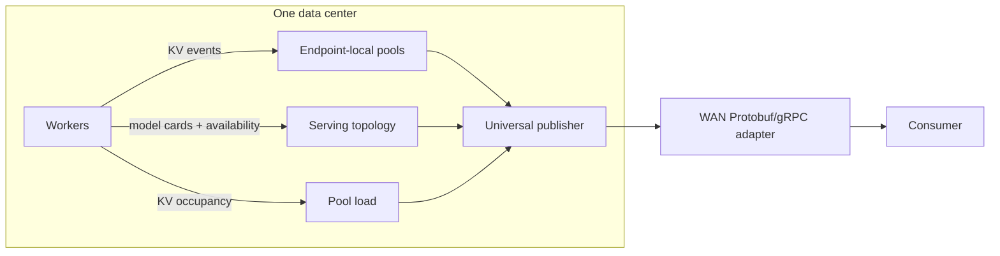

**Experimental.** NVIDIA Dynamo's DC KV Relay exports compact facts about a data center's
key-value (KV) cache and serving topology. It keeps exact block ownership local and publishes a
Cuckoo-filter (CKF) projection for each pool, avoiding replication of every worker's full event
stream across the WAN. Consumers decide how to query and use the published facts.

For deployment, see [Deploy the DC KV Relay](../../../../kubernetes/kv-aware-routing/kv-dc-relay.md).
For flags and defaults, see [Multi-Datacenter KV Relay Configuration](../../../../reference/components/kv-dc-relay-configuration.md).

## Architecture

Relay runs as a Dynamo component using the shared runtime. Its two discovery projections are:

- **Pool catalog:** endpoint-local physical KV pools and their current producer generations.
- **Serving topology:** model readiness grouped by `(namespace, canonical_model_id)`.

A topology member links to a stable `KvPoolId`; the catalog supplies its current producer.
Endpoints remain separate even when they advertise the same model. A member can contribute
serving dependencies without publishing KV state; pool presence alone never implies readiness.

## Pool and Producer Identity

`PoolId = (identity_version, IndexerDomainId, DcId)` identifies a pool across restarts.
The domain combines cache semantics with routing scope. Routing scope defaults to the endpoint
identity but accepts explicit overrides. Colliding live pools are fenced, not merged.

`ProducerIdentity` adds the pool's generation and CKF layout; replacing it requires a fresh
snapshot. `RelayIdentity` identifies the runtime and Relay incarnation. Descriptor metadata
does not extend the subscription key; `serving_endpoint` names the owner, not an inference ingress.

Exact key fields and compatibility rules belong to the
[gRPC contract](https://github.com/ai-dynamo/dynamo/blob/main/lib/llm/src/kv_dc_relay/docs/grpc-contract.md#producer-identity-key).

## Canonical Models and LoRA

A pool advertises one base-model target and any Low-Rank Adaptation (LoRA) targets sharing its
physical CKF. Distinct hash salts separate base and adapter entries. Adapter readiness is nested
under the base model and can differ from it. Consumers build their own model and alias indexes;
conflicting targets must not be resolved by first-wins ordering.

## Aggregated, Prefill/Decode (PD), and Encode/Prefill/Decode (EPD) Topologies

| Deployment | Pools | Serving topology |
| --- | --- | --- |
| Aggregated | One pool per KV-publishing endpoint | Aggregated workers satisfy the model's serving role. |
| Prefill/decode (PD) | Separate Prefill and Decode pools | Readiness evaluates both roles together. |
| Encode/prefill/decode (EPD) | Separate pools for endpoints with active KV event sources | Encode contributes a dependency even when it has no pool. |

Query each pool using its declared hash semantics; Prefill and Decode formats can differ.
Encode is a base-model dependency, not an adapter-bearing role.

## WAN API

The Protobuf/gRPC adapter exposes catalog, pool filters, readiness, and load as independent
streams, plus a Relay identity query. It forwards universal publication state without a second
CKF mirror or publication pipeline.

RPC schemas, message validation, versioning, errors, and reconnect rules are specified in the
[gRPC contract](https://github.com/ai-dynamo/dynamo/blob/main/lib/llm/src/kv_dc_relay/docs/grpc-contract.md).
The adapter does not provide an overlap RPC or request-routing policy.

## CKF Publication

Exact per-worker ownership stays local. Consumers reconstruct a pool's CKF from a complete
snapshot and contiguous deltas, choosing their own storage layout and query strategy.
A match indicates possible prefix presence, not a guaranteed reusable prefix: fingerprints can
collide and capacity failures can cause omissions. Endpoint resolution and request forwarding
are outside the publication contract.

## Serving Readiness

Readiness follows Dynamo's namespace-wide worker dependencies:

- `READY`: at least one worker is live and required roles are satisfied.
- `UNAVAILABLE`: availability is authoritative but a required role or live worker is missing.
- `UNKNOWN`: a participating endpoint has not yet produced an authoritative availability snapshot.

Legacy cards expose weaker fallback gating. Duplicate roles are facts, not a failure verdict.
LoRA readiness also checks adapter membership. A ready model does not identify an inference ingress.

## Pool Load

Load reports worker KV occupancy and observed/expected rank coverage, not scheduler load.
Missing observations and unknown capacity are not zero load. Complete coverage does not establish
per-rank freshness: a new window can contain retained observations from an earlier report.

## Recovery Boundaries

Worker recovery is rank-local; fencing withdraws one producer generation. Catalog, pool,
readiness, and load have independent revisions and recovery, not one atomic transaction.

For producer invariants, see the
[implementation guide](https://github.com/ai-dynamo/dynamo/blob/main/lib/llm/src/kv_dc_relay/docs/architecture.md).
For consumer actions, see the
[contract lifecycle rules](https://github.com/ai-dynamo/dynamo/blob/main/lib/llm/src/kv_dc_relay/docs/grpc-contract.md#consumer-lifecycle-rules).

## Transport

The optional listener serves plaintext HTTP/2 gRPC. Local pool maintenance runs without it.
Listener configuration and limits are in the
[configuration reference](../../../../reference/components/kv-dc-relay-configuration.md).

### Optional mTLS Sidecar

Transport security belongs to an external proxy, not Relay. For certificate handling, protected
exposure, and probe changes, see the
[Kubernetes sidecar procedure](../../../../kubernetes/kv-aware-routing/kv-dc-relay.md#optional-mtls-sidecar).
