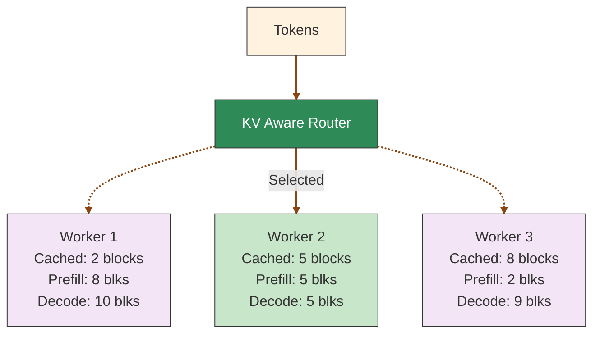
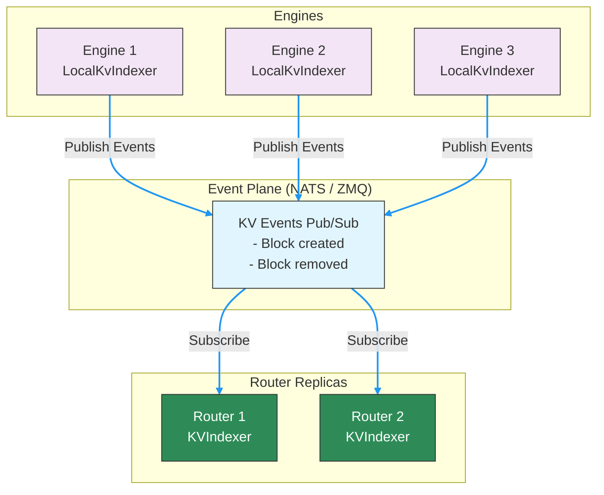
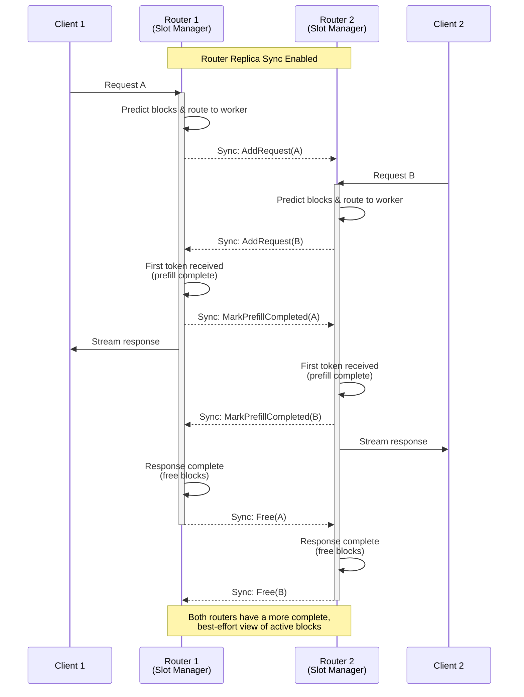

This document describes the internal architecture of the Dynamo KV Router, including block tracking mechanisms, the KV cache optimization system, event handling, and transport modes.

## KV Router Architecture

The KV Router tracks three key metrics for each worker:

1. **Potential Decode Blocks**: The number of blocks that would be used for decoding if a request is routed to a worker. This includes both existing active blocks and new blocks from the incoming request.

2. **Potential New Prefill Blocks**: The number of tokens that need to be computed from scratch on a worker, calculated as:
   - New prefill tokens = Total input tokens - (Overlap blocks × Block size)
   - Potential prefill blocks = New prefill tokens / Block size

3. **Active Requests**: The number of requests already assigned to the worker. An optional block-equivalent weight can include this count in the routing cost.

### Block Tracking Mechanisms

The router maintains block information through two complementary systems:

- **Active Decoding Blocks**: Tracked locally by the router throughout the request lifecycle:
  - Incremented when adding a new request
  - Updated during token generation
  - Decremented upon request completion

- **Cached Blocks**: Maintained globally by the KvIndexer using a prefix tree built from worker-reported KV events. This provides accurate overlap information for routing decisions.

## KV Cache Router

The leading Large Language Models (LLMs) today are auto-regressive and based off of the [transformer architecture](https://arxiv.org/abs/1706.03762). One key inference optimization technique is to cache the already computed keys and values and to reuse them for the future tokens. This is called the [KV Cache](https://developer.nvidia.com/blog/mastering-llm-techniques-inference-optimization/#key-value_caching).

### KV Cache Routing and Load Balancing



The router uses a cost function that combines cache-aware prefill cost, potential decode blocks, and an optional active-request cost.

#### Cost Calculation

1. **Prefill blocks**: Calculated from active prompt-side token load plus the incoming request's input tokens, divided by the block size. The system updates active prompt load when the first output token signals prefill completion.

2. **Potential decode blocks**: Estimated from the request's input tokens and each worker's active sequences. The count updates when requests complete and their blocks are freed.

3. **Active requests**: Read from the same worker-load snapshot as prefill and decode load. Set `decode_active_request_weight` above `0` to charge a block-equivalent cost for each active request.

4. **Cost formula**:
   ```text
   effective_device_credit = overlap_score_credit * overlap_score_credit_decay_factor
   adjusted_prefill_blocks = max(0, (
       prefill_blocks
       - effective_device_credit * device_overlap_blocks
       - host_cache_hit_weight * host_overlap_blocks
       - disk_cache_hit_weight * disk_overlap_blocks
       - shared_cache_multiplier * shared_beyond_blocks
   ))
   active_request_blocks = decode_active_request_weight * active_requests
   cost = (
       prefill_load_scale * adjusted_prefill_blocks
       + potential_decode_blocks
       + active_request_blocks
   )
   ```
   - Lower costs indicate better routing choices
   - `overlap_score_credit` is a finite, nonnegative device-local prefix-overlap credit multiplier
   - `overlap_score_credit_decay_factor` is `1 / (1 + decay * normalized_excess_prefill)`; it is `1` when decay is disabled or the worker has no excess prefill load
   - The combined cache credit is clamped so adjusted prefill blocks cannot become negative
   - `prefill_load_scale` controls adjusted prompt-side load relative to potential decode blocks
   - `decode_active_request_weight` defaults to `0`; use a positive value only when decode step latency depends materially on active batch size
   - Higher overlap credits favor cache reuse (improving TTFT), while lower credits prioritize even load distribution (improving ITL)

   The experimental conditional-disaggregation path has a decode-worker exception. When the decode worker does not track prefill tokens and a positive overlap credit permits conditional prefill bypass, its score is `max(0, potential_decode_blocks - overlap_credit_blocks) + active_request_blocks`; it does not add the ordinary prefill term.

#### Worker Selection

The router selects the worker with the lowest cost. When `router_temperature` is set to a non-zero value, the router uses softmax sampling on the normalized cost logits to introduce randomness in the selection, which can help with load distribution.

Example calculation with `overlap_score_credit = 1.0` and the default `decode_active_request_weight = 0`:
- Worker 1: raw prefill 10 blocks, device overlap 2 blocks, decode 10 blocks => cost = 8 + 10 = 18
- **Worker 2: raw prefill 10 blocks, device overlap 5 blocks, decode 5 blocks => cost = 5 + 5 = 10** (selected - lowest cost)
- Worker 3: raw prefill 10 blocks, device overlap 8 blocks, decode 9 blocks => cost = 2 + 9 = 11

### KV Cache Optimizations

Every inference framework will have a KV Cache for each worker. A popular inference framework library is [vLLM](https://github.com/vllm-project/vllm) where a key contribution was [PagedAttention](https://arxiv.org/abs/2309.06180), which allowed them to manage KV Cache in an efficient way by chunking requests into blocks.

Another popular inference framework, [SGLang](https://github.com/sgl-project/sglang), contributed [RadixAttention](https://arxiv.org/abs/2312.07104) which introduced a prefix tree which allows for efficient matching, inserting and eviction of KV Cache blocks. The prefix tree structure popularized KV Cache reuse.

In Dynamo, we introduce a KVPublisher which emits KV Cache events that occur at each worker and a KVIndexer which keeps track of these events globally.

### KV Block Management Flow

To get a feel for how KV Cache management works on a single worker with KV Cache reuse turned on and where the KVPublisher gets plugged in, we can walk through the KV Block management flow:

1. **Request tokenization**: The incoming prompt is converted into tokens
2. **Block partitioning**: The token sequence is divided into fixed-size blocks (e.g., 16 or 64 tokens per block)
3. **Block hashing**: Each block of tokens is hashed to create a unique identifier. When a LoRA adapter is active, the adapter name is incorporated into the hash so that blocks cached under different adapters produce distinct identifiers.
4. **Cache lookup**:
    - For each block, the system checks if a matching block already exists in the KV cache
    - If a match is found, the existing KV cache block is reused
    - If no match is found, the system proceeds to the next step
5. **Resource allocation**:
    - For blocks without matches, the system attempts to allocate new memory space
    - If sufficient memory is available, allocate memory space and proceed to step 7
    - If memory is constrained, proceed to step 6
6. **Cache eviction** (when necessary):
    - The system applies an eviction policy (e.g., LRU, LFU) to identify blocks for removal
    - Selected blocks are evicted from the cache
    - **KVPublisher emits a KV removed event notifying KVIndexer about the removed block.**
    - Alternatively, some systems may offload less-frequently used blocks to CPU memory.
7. **KV computation**:
    - For new blocks, the model computes key and value tensors
    - These tensors are stored in the newly allocated cache blocks
    - **KVPublisher emits a kv stored event notifying KVIndexer about newly stored blocks**.

Further details can be found for: [SGLang](https://lmsys.org/blog/2024-01-17-sglang/), [TRT-LLM](https://developer.nvidia.com/blog/introducing-new-kv-cache-reuse-optimizations-in-nvidia-tensorrt-llm/) and [vLLM](https://docs.vllm.ai/en/latest/design/automatic_prefix_caching.html#design-automatic-prefix-caching).

## Events

### KVPublisher

The KVPublisher can be initialized and then called in the inference framework where blocks are allocated and removed.

The two types of events are:
- KV stored event
- KV removed event

The publisher can be initialized and used through Python bindings.

### Deterministic Event IDs

Engines do not need to emit deterministic block identifiers in KV events, as the router uses local block hashes (computed from token content) for tracking and matching blocks across workers. However, it is strongly preferred that engines do emit deterministic block identifiers, as this keeps the KvIndexer's internal lookup table smaller and more efficient. To ensure deterministic behavior, all workers should use identical engine versions/configuration. If your engine relies on Python's built-in `hash()` for any event IDs, set `PYTHONHASHSEED=0`; otherwise this setting has no effect.

### KVIndexer

The KVIndexer builds and maintains a global view of cached blocks in a prefix tree. We modify the original prefix tree by also storing the worker id on each node. This is so we can return the number of matched blocks for each worker.

The KVIndexer has a method `find_matches_for_request`, which takes in tokens and returns a dictionary with keys of worker id and values of the number of matched KV Blocks.

The KVIndexer supports two backend implementations, selected via `--router-event-threads`:

- **Single-threaded RadixTree** (`--router-event-threads 1`): Events are processed in a dedicated single-threaded tokio runtime via channel-based dispatch. Also supports TTL retention and experimental per-rank capacity-bounded LRU retention for `--no-router-kv-events` approximate mode.

- **ConcurrentRadixTree** (default, `--router-event-threads N` where N > 1): A thread-safe radix tree with a pool of N worker threads for event processing and approximate routing-decision writes (default: 4). Uses sticky worker-rank routing so request acquire, output materialization, release, capacity update, and reset operations share one FIFO. Read operations (`find_matches`) execute concurrently with writes.

### Inter-Router Communication

In distributed deployments with multiple routers, each router initially sees only the active requests it routed. With replica sync enabled, routers exchange three best-effort lifecycle event types to improve that view:

1. **AddRequest**: Notifies peer routers when a request is assigned to a worker. It carries the request ID, worker ID and DP rank, token sequence, whether to track prefill tokens, the expected output length, and the prefill load hint.

2. **MarkPrefillCompleted**: Signals when a request moves from prefill to decode phase, allowing routers to update their worker load calculations by excluding completed prefill tokens.

3. **Free**: Indicates request completion and resource release, enabling accurate block reference counting across all routers.

Each event carries a unique router ID to prevent self-event processing. Publication is fire-and-forget and the bounded outbound publisher queue drops the newest event when full. These events improve cross-replica active-load estimates; they do not synchronize prefix-cache state or guarantee identical routing decisions. Output-block growth is tracked locally rather than published as a lifecycle event. The embedded `KvRouter` runs one CLOCK reaper and expires idle request leases after roughly one to two scans; configure its scan interval with `DYN_ROUTER_ACTIVE_REQUEST_EXPIRY_SECS` (default `300` seconds). Each router expires local and mirrored lease copies independently. Expiry removes only local scheduler state and any local approximate-LRU references; it never publishes `Free`. Explicit finish, abort, drop, or free operations publish `Free`, and remain idempotent if another router already expired its mirror. Peer leases refresh only on replicated lifecycle events, not output chunks.

## Event Transport Modes

KV cache events use fire-and-forget pub/sub through the configured event plane. Workers maintain local radix trees, and routers rebuild state by querying workers on startup. The event plane supports both NATS Core and ZMQ.

### Event Plane with Local Indexers

By default, workers have local indexer enabled. Each worker maintains its own local radix tree (local indexer) and publishes events over the generic event plane (NATS Core or ZMQ, depending on `--event-plane`). Each worker assigns monotonically increasing event IDs to its events. The router detects gaps in event sequences and recovers missed events by querying the worker's local indexer directly.

- **Best for**: Low-latency event delivery, multi-router deployments, and deployments without NATS (using the ZMQ event plane)
- **Tradeoffs**: State persists on workers (not centralized); recovery depends on workers being available



**How gap detection works:**
1. Each worker assigns monotonically increasing event IDs starting from 0
2. The router tracks the last received event ID per worker
3. If an event arrives with `event_id > last_id + 1`, the router detects a gap
4. The router resets that worker rank and requests a full snapshot (`start_event_id=None`, `end_event_id=None`)
5. On worker discovery (Added event), the router dumps the worker's entire local indexer state

**Startup behavior:**
- When a worker is discovered, the router queries and ingests its full local indexer state
- When a worker is removed, the router removes all its blocks from the global radix tree

> [!NOTE]
> Workers enable their local indexer by default so routers can recover missed events and rebuild state after a restart.

### Local Active Block Management with Replica Sync

In addition to cached blocks, each router replica needs to track active blocks (blocks being used for ongoing generation) as load metrics. Since this information is highly time-sensitive, it should be predicted immediately when:
- The router receives and routes a request
- The first token is generated (prefill complete)
- The response ends (request freed)

This is managed locally in each router via a "slot manager". With `--router-replica-sync`, router replicas exchange lifecycle predictions through the configured Runtime event plane (ZMQ by default, with NATS Core available by configuration).



This dual-layer approach—worker-recoverable KV cache state and ephemeral, best-effort active-block synchronization across router replicas—balances cache reuse with current load without treating router lifecycle events as authoritative storage.

## See Also

- **[Router README](overview.md)**: Quick start guide for the KV Router
- **[Configuration and Tuning](configuration-and-tuning.md)**: Router flags, tuning, and production setup
- **[Router Examples](router-examples.md)**: Python API usage and custom routing patterns
- **[KV Event Publishing for Custom Engines](../../../advanced-customizations/writing-custom-backends/publish-kv-events.md)**: Integrate custom inference engines with KV-aware routing
