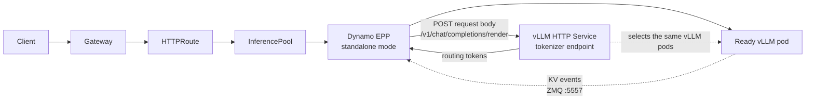
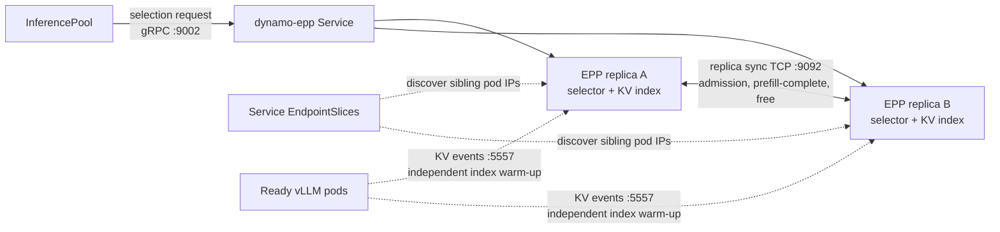

<Warning>
This on-ramp uses the **experimental standalone mode** of the Dynamo Endpoint Picker Plugin (EPP).
This is a special operator-free integration for existing vanilla vLLM fleets, not the standard
operator-managed Gateway API path. Standalone mode is not available in a published Dynamo release
yet. Use an image built from a Dynamo revision that includes standalone EPP support.
</Warning>

Use this on-ramp to add Dynamo's advanced KV-aware routing to
[Gateway API Inference Extension (GAIE)](https://github.com/kubernetes-sigs/gateway-api-inference-extension)
deployments that run stock `vllm serve` workers. **Stock vLLM** means the upstream vLLM container
images. You do not need to replace them with Dynamo vLLM images, install the Dynamo operator, or
migrate the rest of the deployment to Dynamo. The standalone Dynamo Endpoint Picker Plugin (EPP)
adds the routing layer while your Gateway, `HTTPRoute`, and `InferencePool` remain standard GAIE
resources and your workers keep running the upstream vLLM images.

The EPP runs the same Dynamo worker selection service used by a full Dynamo deployment. In standalone
mode, it runs in-process without a `DynamoGraphDeployment` (DGD) or the Dynamo distributed runtime
and event plane.

This is still the **Gateway API routing topology** described in
[KV-Aware Routing on Kubernetes](overview.md). Standalone mode changes who creates the
resources and how the EPP discovers worker state; it does not add a third request-entry topology.

## Architecture



The `InferencePool` is the source of truth for the worker labels and HTTP port. The EPP watches that
pool and Ready pods in its namespace, subscribes directly to each worker's KV event socket, and calls
vLLM's `/v1/chat/completions/render` endpoint to tokenize each routing request. The Gateway forwards
the original request to the selected pod. The render Service is not a separate renderer workload; it
is a stable Kubernetes Service address for the HTTP endpoint served by the same vLLM pods.

| Concern | Standalone on-ramp | Operator-managed Gateway API routing |
|---|---|---|
| Workers | Stock vLLM pods | Dynamo workers and direct-mode Frontend sidecars |
| Resource lifecycle | User-managed Deployments, Services, RBAC, `InferencePool`, and `HTTPRoute` | DGD and Dynamo operator |
| Worker discovery | Kubernetes pod watch driven by `InferencePool.spec.selector` | Dynamo runtime discovery |
| KV state | Direct per-pod vLLM ZMQ subscriptions | Dynamo event plane |
| Tokenization | vLLM `/v1/chat/completions/render` Service | Dynamo model-card preprocessor |
| Supported serving shape | Aggregated vLLM with data-parallel size 1 per pod | Aggregated and disaggregated Dynamo deployments |

For the operator-managed topology and generated-resource boundary, see
[Using GAIE with Dynamo](gateway-api.mdx).

## Before You Begin

You need:

- A Kubernetes cluster with GPU nodes.
- `kubectl` and Helm configured for the cluster.
- A Dynamo source checkout.
- A container registry that every cluster node can pull from.
- Two schedulable GPUs for the example's two vLLM replicas. You can scale the worker Deployment to
  one replica for a smoke test.

The example serves the public `Qwen/Qwen3-0.6B` model, which does not require a Hugging Face token.

## Build the EPP Image

Standalone mode is not available in a published Dynamo image yet. From the repository root, build
the Rust EPP from the current source revision and push it to your container registry:

```bash
export EPP_IMAGE=registry.example.com/your-project/dynamo-epp:standalone

make -C deploy/inference-gateway/ext-proc \
  IMAGE_TAG="$EPP_IMAGE" \
  image-push
```

## Choose a Deployment Path

Choose the path that matches your starting point:

- **Deploy from Scratch** installs the Gateway API layer and applies the complete example, including
  vLLM workers, the EPP, an `InferencePool`, and an `HTTPRoute`.
- **Use the Dynamo EPP in an Existing GAIE Deployment** keeps your current Gateway, `HTTPRoute`,
  `InferencePool`, and vLLM workers. Deploy a replacement EPP as shown below, or adapt the existing
  EPP Deployment in place with the same configuration.

Both paths use the same example names so the verification commands apply to either path:

| Resource | Example Name |
|---|---|
| Workload namespace | `gaie-vllm-onramp` (`$NAMESPACE`) |
| Gateway namespace | `agentgateway-system` (`$AGW_NAMESPACE`) |
| Gateway | `inference-gateway` |
| vLLM Deployment | `vllm-qwen` |
| vLLM HTTP/render Service | `vllm-qwen-render` |
| EPP Deployment and Service | `dynamo-epp` |
| InferencePool | `vllm-qwen-pool` |
| HTTPRoute | `vllm-qwen-route` |

<Note>
For an existing GAIE deployment, these are example names. Replace them in the commands and YAML
snippets with the names of your existing resources.
</Note>

Set the shared namespace variables:

```bash
export NAMESPACE=gaie-vllm-onramp
export AGW_NAMESPACE=agentgateway-system
```

<Tabs>
<Tab title="Deploy from Scratch">

### Install the Gateway API Layer

Install Gateway API, GAIE, agentgateway, and the Gateway:

```bash
./deploy/inference-gateway/scripts/install_gaie_crd_agentgateway.sh
```

The script pins the supported Gateway API, GAIE, and agentgateway versions. It creates the
`inference-gateway` Gateway in `$AGW_NAMESPACE`; the `http` listener allows `HTTPRoute` resources
from workload namespaces. The on-ramp resources remain in `$NAMESPACE`.

Verify that the Gateway is programmed:

```bash
kubectl wait gateway/inference-gateway -n "$AGW_NAMESPACE" \
  --for=condition=Programmed --timeout=180s
```

### Configure Model Access

The public `Qwen/Qwen3-0.6B` model in the example does not require authentication. To substitute a
gated or private Hugging Face model, create a Secret in the workload namespace before deploying:

```bash
read -rsp "Hugging Face token: " HF_TOKEN
echo
kubectl create secret generic hf-token-secret -n "$NAMESPACE" \
  --from-literal=HF_TOKEN="$HF_TOKEN"
unset HF_TOKEN
```

Add the Secret reference to the vLLM container in `agg.yaml`:

```yaml
env:
  - name: HF_TOKEN
    valueFrom:
      secretKeyRef:
        name: hf-token-secret
        key: HF_TOKEN
```

### Deploy the On-ramp

The installation script above creates the Gateway API and GAIE layer. The example manifest then
creates the workload layer in `$NAMESPACE`:

- Two stock vLLM workers with prefix caching, KV events, and readiness probes.
- A `vllm-qwen-render` Service that selects those same workers and exposes their HTTP port for
  `/v1/chat/completions/render`.
- Namespaced RBAC: `get`, `list`, and `watch` for pods, `InferencePool`, and `EndpointSlice`
  resources; `get` for the EPP peer Service.
- Two standalone EPP replicas and their gRPC and replica-synchronization Service.
- An `InferencePool` and an `HTTPRoute` that attaches to the cross-namespace Gateway.

Set `VLLM_IMAGE` to the vLLM image your platform uses, including its release tag or digest. Use a
digest for reproducible deployments. Apply the manifest from the repository root using that image
and the EPP image you pushed:

```bash
sed -e "s#dynamo/dynamo-epp:dev#${EPP_IMAGE:?Set EPP_IMAGE to the image you pushed}#" \
  -e "s#<VLLM_IMAGE>#${VLLM_IMAGE:?Set VLLM_IMAGE to your chosen vLLM image}#" \
  deploy/inference-gateway/ext-proc/examples/onramp/agg.yaml |
  kubectl apply -n "$NAMESPACE" -f -
```

The checked-in manifest is also available as
[`agg.yaml`](https://github.com/ai-dynamo/dynamo/blob/main/deploy/inference-gateway/ext-proc/examples/onramp/agg.yaml).

</Tab>
<Tab title="Use the Dynamo EPP in an Existing GAIE Deployment">

The starting point for this path is a working GAIE request path with a Gateway, `HTTPRoute`,
`InferencePool`, EPP Deployment and Service, and upstream vLLM Deployment. Keep the Gateway,
`HTTPRoute`, `InferencePool`, and vLLM workload. Choose how to deploy the Dynamo EPP:

- **Deploy a replacement EPP.** Create a new Dynamo EPP Deployment and Service, switch
  `InferencePool.spec.endpointPickerRef` to the new Service, and then remove the previous EPP
  Deployment and Service.
- **Adapt the existing EPP Deployment in place.** Change its container image and configuration to
  run the Dynamo EPP. Keep the existing Service name and port so
  `InferencePool.spec.endpointPickerRef` does not change.

The steps below demonstrate the replacement path and use `dynamo-epp` for the new Deployment and
Service. To adapt the existing Deployment instead, apply the same Dynamo image, environment
variables, ports, readiness probe, ServiceAccount, and RBAC in place. Keep its labels aligned with
the existing Service selector, and keep the Service and `endpointPickerRef` unchanged.

Ensure that the Gateway listener allows routes from `$NAMESPACE`. See
[Install Gateway API Inference Extension](../installation/gateway-api-routing.mdx) for the shared agentgateway and Istio
prerequisites.

### Configure vLLM

Every worker selected by the `InferencePool` must:

- Expose its OpenAI-compatible server port.
- Pass a readiness probe before the EPP registers it.
- Enable prefix caching.
- Publish KV cache events over ZMQ.
- Use the same block size and maximum batched-token value configured on the EPP.

The `InferencePool` selects pods, not the Deployment object. Ensure that its selector label is on
`spec.template.metadata.labels`. To add the example label without replacing existing pod-template
labels, patch the vLLM Deployment:

```bash
kubectl patch deployment/vllm-qwen -n "$NAMESPACE" --type merge \
  --patch '{"spec":{"template":{"metadata":{"labels":{"app":"vllm-qwen"}}}}}'
```

Do not use `kubectl label deployment` for this step. That command changes
`Deployment.metadata.labels`, which does not label the worker pods.

Compare a typical existing vLLM container with the changes required by the on-ramp. In both
snippets, replace `<VLLM_IMAGE>` with your existing vLLM image reference, including its release tag
or digest.

**Before — existing vLLM container:**

```yaml
containers:
  - name: vllm
    image: <VLLM_IMAGE>
    args:
      - --model
      - Qwen/Qwen3-0.6B
      - --port
      - "8000"
    ports:
      - name: http
        containerPort: 8000
```

**After — vLLM container prepared for the Dynamo EPP:**

```yaml
containers:
  - name: vllm
    image: <VLLM_IMAGE>
    args:
      - --model
      - Qwen/Qwen3-0.6B
      - --served-model-name         # NEW: pin the OpenAI model ID used by the EPP
      - Qwen/Qwen3-0.6B
      - --port                      # CHECK: must match InferencePool.spec.targetPorts
      - "8000"
      - --enable-prefix-caching     # NEW: enable prefix reuse for KV-aware routing
      - --block-size                # NEW: must equal DYN_KV_CACHE_BLOCK_SIZE
      - "16"
      - --max-num-batched-tokens    # NEW: must equal DYN_EPP_MAX_NUM_BATCHED_TOKENS
      - "8192"
      - --kv-events-config          # NEW: publish KV events on a ZMQ socket for the EPP
      - '{"publisher":"zmq","endpoint":"tcp://*:5557","enable_kv_cache_events":true}'
    ports:
      - name: http
        containerPort: 8000
      - name: kv-events             # NEW: KV-event port the EPP subscribes to
        containerPort: 5557
    readinessProbe:                 # NEW: expose the worker only after vLLM can serve
      httpGet:
        path: /health
        port: http
```

<Warning>
If your workers run as non-root, set `runAsUser` to a UID that exists in the image's
`/etc/passwd` — `2000` (the `vllm` user) for `vllm/vllm-openai`. While configuring its compile
cache, PyTorch resolves the running UID through `getpass.getuser()`, so an arbitrary UID with no
passwd entry fails that lookup and vLLM exits on import before parsing any argument. The on-ramp
itself adds no requirement here: the image runs as root by default and needs no such change.
</Warning>

To tokenize each routing request, the Dynamo EPP calls vLLM's
`/v1/chat/completions/render` endpoint through a stable Service URL. This is not a separate renderer
deployment; the endpoint runs on the same vLLM pods that serve inference requests. Reuse an existing
HTTP Service when it selects the same homogeneous vLLM pods, or create a Service such as:

```yaml
apiVersion: v1
kind: Service
metadata:
  name: vllm-qwen-render
spec:
  selector:
    app: vllm-qwen
  ports:
    - name: http
      port: 8000
      targetPort: http
```

Because the Service and EPP are in the same namespace, its base URL is
`http://vllm-qwen-render:8000`. Set `DYN_EPP_TOKENIZER_SERVICE_URL` to that URL, or to the
corresponding URL for the existing Service you reuse.

### Deploy a Replacement EPP

Create a ServiceAccount with namespaced `get`, `list`, and `watch` access to pods, `InferencePool`
resources, and `EndpointSlice` resources. When you set `DYN_EPP_PEER_SERVICE`, also grant `get`
access to Services. Create the replacement `dynamo-epp` Service with gRPC port `9002` before its
Deployment. The complete ServiceAccount, RBAC, Deployment, and Service definitions are available in
the [`agg.yaml` EPP resources](https://github.com/ai-dynamo/dynamo/blob/main/deploy/inference-gateway/ext-proc/examples/onramp/agg.yaml).

Then create the replacement Deployment with the Dynamo EPP image. The environment variables belong
to the EPP container in
`spec.template.spec.containers[].env`:

```yaml
apiVersion: apps/v1
kind: Deployment
metadata:
  name: dynamo-epp
spec:
  replicas: 2
  selector:
    matchLabels:
      app: dynamo-epp
  template:
    metadata:
      labels:
        app: dynamo-epp
    spec:
      serviceAccountName: dynamo-epp
      containers:
        - name: epp
          image: <EPP_IMAGE>
          env:
            - name: DYN_EPP_MODE
              value: standalone
            - name: DYN_EPP_INFERENCE_POOL_NAME
              value: vllm-qwen-pool
            - name: POD_NAMESPACE
              valueFrom:
                fieldRef:
                  fieldPath: metadata.namespace
            - name: DYN_MODEL_NAME
              value: Qwen/Qwen3-0.6B
            - name: DYN_EPP_TOKENIZER_SERVICE_URL
              value: http://vllm-qwen-render:8000
            - name: DYN_EPP_TOKENIZER_PROTOCOL
              value: vllm-render
            - name: DYN_KV_CACHE_BLOCK_SIZE
              value: "16"
            - name: DYN_EPP_KV_EVENT_PORT
              value: "5557"
            - name: DYN_EPP_MAX_NUM_BATCHED_TOKENS
              value: "8192"
            - name: DYN_EPP_PEER_SERVICE
              value: dynamo-epp
            - name: POD_IP
              valueFrom:
                fieldRef:
                  fieldPath: status.podIP
```

The example runs two EPP replicas, so `DYN_EPP_PEER_SERVICE` and `POD_IP` are part of its required
configuration.

The model name, block size, event port, and maximum batched-token values in the example are one
coherent configuration. Change them together when adapting another model or vLLM deployment.

### Connect the InferencePool

Confirm these fields on the existing `InferencePool`:

- Confirm that `spec.selector` matches labels on the vLLM pod template, not only the Deployment.
- Confirm that `spec.targetPorts[0].number` is the vLLM HTTP port.
- Update `spec.endpointPickerRef` to the replacement `dynamo-epp` Service on port `9002`. When
  adapting the existing Deployment behind the same Service and port, this field does not change.

The Dynamo EPP reads the pool at runtime. Do not duplicate the worker selector or HTTP port in EPP
environment variables.

If you deployed a replacement, remove the previous EPP Deployment and Service after switching
`spec.endpointPickerRef`.

</Tab>
</Tabs>

## Verify the Deployment

These commands apply to both paths because they use the same example names. Wait for the vLLM
workers and EPP:

```bash
kubectl wait deployment/vllm-qwen -n "$NAMESPACE" \
  --for=condition=Available --timeout=600s

kubectl wait deployment/dynamo-epp -n "$NAMESPACE" \
  --for=condition=Available --timeout=180s
```

Confirm that the route attached to the intended Gateway:

```bash
kubectl get httproute/vllm-qwen-route -n "$NAMESPACE" \
  -o jsonpath='{range .status.parents[*]}{.parentRef.name}{"\\t"}{range .conditions[*]}{.type}={.status}{" "}{end}{"\\n"}{end}'
```

The output should identify `inference-gateway` and report `Accepted=True` and
`ResolvedRefs=True`.

Find the Service generated for the Gateway and start a port-forward:

```bash
export GATEWAY_SERVICE=$(kubectl get service -n "$AGW_NAMESPACE" \
  -l gateway.networking.k8s.io/gateway-name=inference-gateway \
  -o jsonpath='{.items[0].metadata.name}')

kubectl port-forward -n "$AGW_NAMESPACE" "service/$GATEWAY_SERVICE" 8000:80
```

In another terminal, send an OpenAI-compatible request:

```bash
curl --max-time 120 -sS http://localhost:8000/v1/chat/completions \
  -H 'content-type: application/json' \
  -d '{
    "model": "Qwen/Qwen3-0.6B",
    "messages": [
      {"role": "user", "content": "Write one sentence about prefix caching."}
    ],
    "max_tokens": 64
  }'
```

Inspect the EPP logs near the request:

```bash
kubectl logs -n "$NAMESPACE" deployment/dynamo-epp --tail=200
```

The logs should show worker discovery and endpoint selection. If the model responds but the EPP logs
show no selection, the route is bypassing the `InferencePool`.

## EPP Replication

Each EPP replica has an in-process selector and KV index. When `DYN_EPP_PEER_SERVICE` is set, the EPP
validates that Service at startup, then watches its `EndpointSlice` resources for sibling Pod IPs. Each
replica binds and dials `DYN_EPP_REPLICA_SYNC_PORT`, which defaults to TCP port `9092`; every EPP
selected by the Service must use the same value. They synchronize admission, prefill-complete, and free
events so active-load accounting converges across replicas.



Replica synchronization does not copy the full KV index to a new EPP. A new replica warms its index
from live worker events and optional replay. For consistency details, see
[Standalone Selection Service](../../developer-guide/knowledge-base/modular-components/router/standalone-selection.md).

For a single EPP replica, set `spec.replicas: 1` and remove `DYN_EPP_PEER_SERVICE` and `POD_IP`.

## Standalone EPP Configuration Reference

| Variable | Required | Meaning |
|---|---|---|
| `DYN_EPP_MODE=standalone` | Yes | Runs the embedded selection service without the Dynamo runtime. |
| `DYN_EPP_INFERENCE_POOL_NAME` | Yes | Name of the `InferencePool` that drives worker discovery. |
| `POD_NAMESPACE` | Yes | Namespace containing the EPP, pool, and workers; inject with the downward API. |
| `DYN_MODEL_NAME` | Yes | Served model ID. Requests must use the same `model` value. |
| `DYN_EPP_TOKENIZER_SERVICE_URL` | Yes | Base URL of the vLLM render Service. |
| `DYN_EPP_TOKENIZER_PROTOCOL=vllm-render` | Yes | Tokenizer wire protocol; this is the only supported value. |
| `DYN_KV_CACHE_BLOCK_SIZE` | Yes | Must equal vLLM `--block-size`. |
| `DYN_EPP_KV_EVENT_PORT` | No | Per-pod vLLM KV event port; defaults to `5557`. |
| `DYN_EPP_KV_EVENT_REPLAY_PORT` | No | Per-pod replay port for KV event gap recovery. |
| `DYN_EPP_MAX_NUM_BATCHED_TOKENS` | Policy-dependent | Must equal vLLM `--max-num-batched-tokens`; required when router queue thresholds are enabled. |
| `DYN_EPP_TOTAL_KV_BLOCKS` | No | Optional per-worker total KV block hint. |
| `DYN_EPP_SELECTION_INDEXER_THREADS` | No | KV indexer thread count; defaults to `4`. |
| `DYN_EPP_TOKENIZATION_TIMEOUT_MS` | No | Render request timeout; defaults to `5000`. |
| `DYN_EPP_TOKENIZER_MAX_RESPONSE_BYTES` | No | Maximum render response size; defaults to `16777216`. |
| `DYN_EPP_MAX_INFLIGHT_REQUESTS` | No | Concurrent EPP request guardrail; defaults to `1024`, and excess requests receive `503`. |
| `DYN_EPP_PEER_SERVICE` | No | Existing EPP Service used to discover sibling replicas. Enables replica sync. |
| `DYN_EPP_REPLICA_SYNC_PORT` | No | ZMQ port every replica binds and dials for replica sync; defaults to `9092`. All replicas selected by `DYN_EPP_PEER_SERVICE` must use the same value. |
| `POD_IP` | With peer service | EPP pod IP used to exclude the local replica from its peer set. |

## Scope and Limitations

The standalone path currently targets aggregated vLLM serving with data-parallel size 1 per pod. It
does not provide the DGD/operator lifecycle, Dynamo runtime discovery, disaggregated prefill/decode
orchestration, request migration, topology-aware routing, or full operator-managed observability.

Use [GAIE with Dynamo](gateway-api.mdx) when you want the supported
operator-managed lifecycle, Dynamo workers, or disaggregated serving. Use
[Gateway API Routing Reference](../../reference/components/gateway-api-routing.mdx) for the DGD and
operator-generated resource contract; that contract does not configure standalone mode.

## Troubleshoot

| Symptom | Check |
|---|---|
| EPP exits with `standalone is not yet supported` | The image predates the standalone implementation. Build or select the required `dynamo-epp` revision. |
| EPP stays not ready | Confirm the pool exists, its selector is valid, at least one matching pod is Ready, and EPP RBAC can watch pods and `InferencePool` resources. |
| EPP replicas do not sync active load | Confirm `DYN_EPP_PEER_SERVICE` names the EPP Service and EPP RBAC grants `list` and `watch` access to `EndpointSlice` resources. |
| EPP exits while validating its peer Service | Confirm the Service exists and EPP RBAC grants `get` access to Services. |
| EPP reports no schedulable workers | Set `DYN_EPP_MAX_NUM_BATCHED_TOKENS` to the vLLM `--max-num-batched-tokens` value when queueing is enabled. |
| Route has no accepted parent | Confirm `parentRefs[].namespace` names the Gateway namespace, `sectionName` names its listener, and the listener allows routes from the workload namespace. |
| Tokenization fails | Check the render Service endpoints and call `/v1/chat/completions/render` from the EPP namespace. |
| Prefix locality does not improve | Confirm the vLLM event publisher and EPP event port match, and that the EPP block size equals vLLM `--block-size`. |

Follow the full request path when debugging:

```bash
kubectl describe gateway/inference-gateway -n "$AGW_NAMESPACE"
kubectl describe httproute/vllm-qwen-route -n "$NAMESPACE"
kubectl get inferencepool/vllm-qwen-pool -n "$NAMESPACE" -o yaml
kubectl get pods -n "$NAMESPACE" -l app=vllm-qwen -o wide
kubectl logs -n "$NAMESPACE" deployment/dynamo-epp --tail=200
```

## Clean Up the From-Scratch Example

If you used the **Deploy from Scratch** path, delete the example resources:

```bash
kubectl delete -n "$NAMESPACE" \
  -f deploy/inference-gateway/ext-proc/examples/onramp/agg.yaml
```

Delete the namespace only if it contains no resources you want to keep:

```bash
kubectl delete namespace "$NAMESPACE"
```
