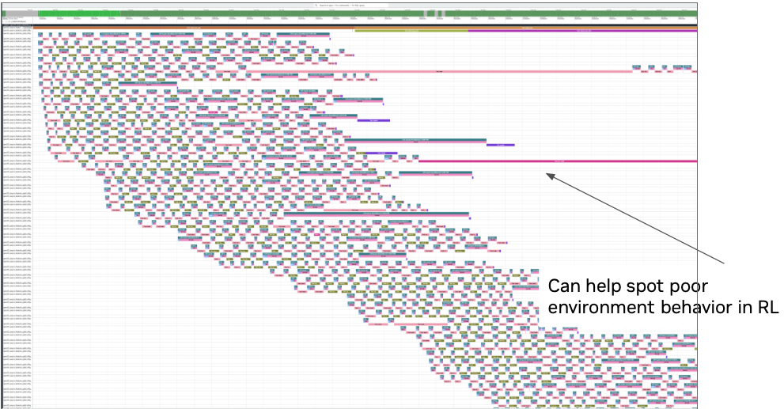
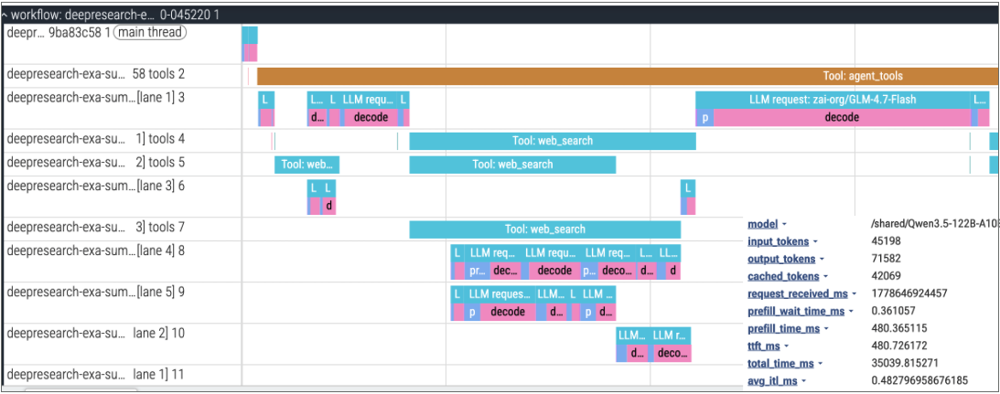

Start with the live run: correlate framework and Dynamo identity, localize the bottleneck, and validate the capture. Then replay or simulate the request plane. Dynamo does not reproduce the trainer, reward pipeline, policy transitions, sample acceptance, or model-dependent decisions.

## Join the Right Data

No single component owns the complete RL timeline:

| Source | What it contributes |
|---|---|
| Framework records | Run, rollout, attempt, trainer step, target policy, acceptance, and reward |
| Dynamo request traces | Request identity, timing, token shape, worker data, and replay hashes |
| Router metrics | Queueing, cache overlap, routing overhead, and worker selection |
| Backend metrics and logs | Batching, generation, cache, errors, and restarts |
| Update-control records | Target workers, transfer, cache reset, version, readiness, and resume timing |

Keep high-cardinality rollout, sample, attempt, and policy IDs in framework records, traces, or logs. Use Prometheus labels only for bounded dimensions such as model, backend, worker role, and status class.

## Establish Request Identity

For multi-turn trajectories, send Dynamo session headers when their semantics match:

```text
X-Dynamo-Session-ID: rollout-run42-sample7
X-Dynamo-Parent-Session-ID: rollout-run42-parent2
```

Use `x-request-id` for cross-component logs and distributed traces. Native SGLang `/generate` gives a body `rid` precedence over that header, so use one stable `rid` or omit it.

Dynamo does not define typed RL rollout, trainer-step, or policy-version fields. Keep those values in the framework and join them through opaque request or session identity. Session identity supports correlation; it does not enable affinity unless the router is configured for it and does not validate policy freshness.

## Capture Request Traces

Enable compact request-end traces:

```bash
export DYN_REQUEST_TRACE=1
export DYN_REQUEST_TRACE_RECORDS=request_end
export DYN_REQUEST_TRACE_SINKS=file
export DYN_REQUEST_TRACE_FILE_PATH=/tmp/rl-run/request-trace
export DYN_REQUEST_TRACE_FILE_FORMAT=jsonl_gz
```

Use [Request Trace Reference](../../reference/observability/request-traces.mdx) for the exact schema and sink settings. Validate trace counts against framework attempts before interpreting timing. Canceled, failed, retried, and accepted attempts must remain distinguishable.

The OpenAI chat-completion path can also capture explicitly allowlisted application headers on `request_payload` rows. Those records can contain unredacted request and response data. Use opaque IDs and follow the workload's retention and access policy; never capture credentials or sensitive prompts by default.

## Profile a Rollout in Perfetto

Convert the trace into a timeline:

```bash title="Create a Perfetto trace"
python3 benchmarks/request_trace/convert_to_perfetto.py \
  /tmp/rl-run/request-trace.*.jsonl.gz \
  --output /tmp/rl-run/request-trace.perfetto.json
```

Open the result in the [Perfetto UI](https://ui.perfetto.dev/). The timeline shows request, prefill, and decode slices; agentic workloads can also include inferred or explicitly reported tool spans. Use the framework's rollout and attempt records alongside the timeline to distinguish serving time from environment, tool, reward, and trainer time. See [Agent Tracing](../agents/agent-tracing.md) for tool-event capture and detailed Perfetto guidance.

Use the overview to scan concurrent rollouts for long-tail environment or tool behavior.



Zoom in on a rollout to separate tool time from request processing, prefill, and decode, then inspect token and latency fields for a selected request.



## Diagnose the Live Run

Work from the framework inward:

1. **Framework:** Was the attempt dispatched, canceled, retried, accepted, rejected, or blocked outside serving?
2. **Frontend and router:** Did the request arrive, wait in a queue, and reach the expected worker?
3. **Backend:** Did the engine queue, prefill, decode, cancel, error, or restart?
4. **Policy update:** Which target policy and worker set should have been active, and had verification completed?

Align clocks before comparing sub-second timing.

### Queueing

Compare framework dispatch, frontend receipt, router queue time, engine queue state, active prefill/decode work, request length, and timeout behavior. A gap before frontend receipt belongs outside Dynamo. Router queue time means Dynamo intentionally deferred dispatch; engine queueing after dispatch points to backend capacity or worker imbalance.

### Cache Reuse

For repeated prompts, compare trace sequence hashes, model and tokenizer identity, cache events, router overlap signals, worker placement, and reset boundaries. After a policy update, expect old-policy cache state to be cleared and separate the required warm-up from a regression.

### Policy Refresh

Compare the framework gate, selected worker set, per-worker pause, transfer, cache, version, readiness, resume, and post-update results. Request traces do not contain a standardized weight-update event, so preserve that lifecycle in framework or control records and place it on the same time axis.

## Build a Minimum Operations View

A useful dashboard or query pack answers:

- How many attempts were dispatched, completed, canceled, retried, accepted, or rejected?
- Where is time spent before and inside serving?
- Are shared prompts reusing KV state?
- Are requests and active work balanced across workers?
- Which policy and worker set should be serving?
- How long do gate, transfer, cache reset, verification, and warm-up take?
- Did a serving improvement increase accepted or fresh trajectories per unit time?

Define the numerator, denominator, freshness rule, and phase boundary for every RL throughput or goodput metric.

## Replay the Request Plane

A validated `request_end` trace preserves request schedule, input and output lengths, sequence-sharing hashes, KV block size, and supported session relationships. Before replaying, reconcile request and token counts, session counts, block size, skipped rows, and final trace shards.

| Path | Use it for | Boundary |
|---|---|---|
| Live replay | Measure serving latency, throughput, cache behavior, and regressions on real workers | Synthetic requests do not rerun training, rewards, tools, or original model decisions. |
| Offline DynoSim | Compare worker counts, routing, cache capacity, topology, and planner choices | Results are directional until calibrated against a matching live run. |

Save an offline prediction config as `/tmp/rl-run/dynosim.yaml`. Set the `engine` identity to match
the deployment that produced the trace, and list every trace shard explicitly under `paths`:

```yaml
traffic:
  source:
    type: trace
    format: dynamo
    paths:
    - /tmp/rl-run/request-trace.000000.jsonl.gz
  load: {type: trace_timestamps, speedup: 1.0}
engine:
  mode: aggregated
  model: Qwen/Qwen3-0.6B
  hardware: h200_sxm
  backend: vllm
  workers:
    aggregated:
      parallelism: {replicas: 4, tensor: 1, pipeline: 1, attention_data: 1, moe_tensor: 1, moe_expert: 1}
router:
  policy: kv_router
```

Run DynoSim on the captured trace:

```bash
aisimulate predict \
  --stack dynamo \
  --config /tmp/rl-run/dynosim.yaml \
  --output-dir /tmp/rl-run/dynosim-output
```

Change one serving factor at a time. Use [DynoSim](../../cli/operations/simulation-with-dynosim/overview.md) for the complete workflow and [Agent Trace Replay](../agents/agent-simulation.mdx) for the live synthetic replay path.

## Understand Fidelity

| Dimension | Preserved | Omitted or approximated |
|---|---|---|
| Request schedule | Relative arrivals and supported session order | Framework scheduling cause and trainer barriers |
| Token shape | Input/output lengths and block-level sharing | Original text, exact tokens, rewards, and semantics |
| Routing and KV | Live or simulated router and cache behavior | Policy-version eligibility and sample acceptance |
| Engine timing | Live measurement or selected timing model | Effects absent from that model |
| Policy updates | Request-traffic gaps | Transfer, cache reset, failure, and trainer overlap |
| Training | None | Optimizer, reward, advantage, checkpoint creation, and convergence |

Do not call this closed-loop RL simulation. It reproduces serving questions for a captured request graph.

## Calibrate Results

For any simulated configuration that informs a decision:

1. Run the trace against the matching live deployment.
2. Run the matching DynoSim configuration.
3. Compare request and token totals, queueing, cache behavior, latency, and utilization where modeled.
4. Report repeated-run spread plus absolute and relative error for the decision metrics.
5. Validate the shortlisted configuration on real GPUs before publishing performance numbers.

Recalibrate when the model, backend, hardware, topology, router, or timing model changes. If variance changes the ranking, report the comparison as inconclusive rather than selecting the favorable run.
