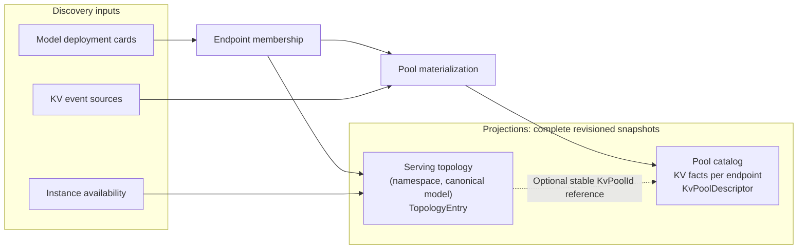

<!--
SPDX-FileCopyrightText: Copyright (c) 2025-2026 NVIDIA CORPORATION & AFFILIATES. All rights reserved.
SPDX-License-Identifier: Apache-2.0
-->

# KV DC Relay: Producer Architecture

This document describes the Rust implementation: module ownership, actor and hub lifecycle,
admission, and recovery invariants. For the system model and deployment shapes, see
[DC KV Relay Concepts](https://github.com/ai-dynamo/dynamo/blob/main/docs/fern/pages/developer-guide/knowledge-base/modular-components/router/multi-dc-kv-routing.md).
For deployment and runtime options, see the
[Kubernetes how-to](https://github.com/ai-dynamo/dynamo/blob/main/docs/fern/pages/kubernetes/kv-aware-routing/kv-dc-relay.md)
and [configuration reference](https://github.com/ai-dynamo/dynamo/blob/main/docs/fern/pages/reference/components/kv-dc-relay-configuration.md).
Wire semantics are specified in [the gRPC contract](grpc-contract.md) and
[the protocol README](../wan/grpc/protocol/README.md).

## Module Map

| Module | Responsibility |
| --- | --- |
| [`host.rs`](../host.rs) | Shared runtime/discovery integration, endpoint task supervision, recovery, and shutdown. |
| [`discovery.rs`](../discovery.rs), [`resolution.rs`](../resolution.rs) | Membership projection, conflicts, and canonical indexer-domain resolution. |
| [`pool_registry.rs`](../pool_registry.rs) | Active pool generations and catalog withdrawal. |
| [`actor.rs`](../actor.rs) | Exact rank ownership, refcounts, CKF mutation, and publication cuts. |
| [`topology.rs`](../topology.rs), [`load.rs`](../load.rs) | Serving readiness and worker-authoritative load projections. |
| [`publication.rs`](../publication.rs) | Transport-neutral source, streams, frames, and error categories. |
| [`publication/hub.rs`](../publication/hub.rs), [`publication/stream.rs`](../publication/stream.rs) | Lazy mirrors, bounded fanout, snapshot bootstrap, and stream continuity. |
| [`wan/grpc.rs`](../wan/grpc.rs), [`wan/grpc/config.rs`](../wan/grpc/config.rs) | gRPC adapter facade and configuration. |
| [`wan/grpc/server.rs`](../wan/grpc/server.rs), [`wan/grpc/service.rs`](../wan/grpc/service.rs) | gRPC listener, RPC adaptation, transport admission, and heartbeats. |
| [`wan/grpc/protocol.rs`](../wan/grpc/protocol.rs) | Protobuf types, explicit wire identity validation, and shared codec exports. |

## Universal Publication Boundary

The `wan::grpc` adapter consumes the existing `RelayPublicationSource`. The host configures
publication resources and passes the source and lifecycle token to `GrpcTransport::start`.
The adapter creates its private source wrapper; the host does not depend on gRPC handlers,
Protobuf conversions, or that wrapper. The universal publisher
owns lazy pool hubs, snapshot cuts, CBI1 encoding, bounded queues, generation fencing, and
snapshot progress deadlines. Idle hubs can be evicted to admit another pool; later subscribers
capture a fresh snapshot from the same producer generation.

An initialized hub retains its CKF mirror and capacity permit while idle. Eviction reclaims both
without retiring the producer generation or withdrawing the pool from the catalog. Admission
limits therefore bound resident mirrors even across sequential subscribe/drop requests.

Snapshot encoding failure, an encoder-task panic, or a publication invariant failure (identity,
lease, sequence, or bucket state) fences the producer generation. Catalog withdrawal is the
authoritative signal that the generation is no longer publishable. Encoder-task cancellation
closes only that subscriber stream, with `UNAVAILABLE` in the gRPC adapter; a client-local
snapshot progress timeout also leaves the generation valid for other subscribers.

The gRPC adapter consumes publication frames and catalog, readiness, and load projections. It
adds protobuf envelopes, transport admission, and heartbeats only after the initial snapshot is
complete. It does not maintain another CKF mirror or implement a second publication pipeline.
The protobuf CBI1 helpers reuse the publisher's codec.

The first subscriber initializes one hub for its producer generation. The hub acquires an actor
publication lease and copies the CKF. Each subscriber captures a consistent snapshot cut and a
bounded delta queue; snapshot encoding runs outside async worker threads under a concurrency
limit. Later subscribers share the hub but receive their own cut and queue. Before the first
subscription, there is no publication hub or full mirror.

CBI1 deltas contain absolute bucket images. Their per-bucket idempotence and sequence checks do
not make an arbitrary multi-bucket update atomic; consumers must validate and install complete
frames before exposing updated state.

The listener is plaintext HTTP/2 gRPC. mTLS is an optional external sidecar deployment described
in the [transport security boundary](grpc-contract.md#transport-security-boundary), not a Relay
implementation feature. Certificates, authentication, and rotation remain outside Relay.

## Inputs

The Relay consumes only DC-local, positively advertised facts:

| Input | Source | Feeds |
| --- | --- | --- |
| Model deployment cards | discovery plane, namespace-wide query | endpoint membership, declared roles and `needs`, model registrations, query semantics, load capacity |
| Instance availability | per-endpoint instance watches | live worker sets; authoritative once the watch delivers its initial snapshot |
| KV event source advertisements | typed `KvEventSource` discovery entries | pool materialization gate, per-`(worker_id, dp_rank)` ingest and recovery |
| Worker KV-occupancy events | DC event plane (`kv_metrics` subject) | authoritative pool KV-load windows |

The Relay never probes workers, never synthesizes facts it cannot observe, and
never assumes another component's internal state.

## The two projections

- The **pool catalog** answers "what KV state exists and how to query it".
- The **topology projection** answers "can this model in this namespace serve a
  request", in the same semantics the Dynamo frontend uses.
- They are deliberately two flat collections, not a tree. A topology member
  links to its pool through the **stable `KvPoolId`**; producer generations are
  resolved through the catalog. Namespace is not a separate `PoolId` field, but
  participates in the endpoint triple used to derive its default routing scope.
  Pool lifecycle remains endpoint-local; namespace names are unique only within one DC.

## Pools

A pool is one serving endpoint's KV publication. `PoolId = (identity_version,
IndexerDomainId, DcId)`. By default, cache semantics cover model source, KV block size,
and hash format; routing scope covers the endpoint triple. Explicit identity material can
replace the default model-source and routing-scope inputs, but not the required block size
or hash format. Distinct endpoints therefore need not derive distinct IDs. Colliding live
`PoolId`s are fenced, never merged; see [identity resolution](../resolution.rs).

A pool **materializes** only when all three conditions hold for the endpoint:

1. the endpoint's cards are structurally materializable (single indexer domain,
   at least one valid registration, and no `PoolMaterialization` or
   `ServingTopology` conflict);
2. the KV-state endpoint resolves unambiguously;
3. at least one expected worker/rank advertises an **active KV event source**.

Losing a source, domain, pool-only condition, or unambiguous KV-state endpoint
**dematerializes** the pool (catalog withdrawal precedes actor teardown), while
the endpoint remains a topology member with no pool link. A `ServingTopology`
conflict also removes the endpoint from the topology projection. A
`ServingBinding` conflict omits only the registration that cannot be resolved;
other valid endpoint bindings remain eligible. This is why there are no phantom
pools: an endpoint that never publishes KV events — a surface-less encode
worker, for example — never appears in the catalog at all.

Each materialized pool owns exactly one CKF actor. Restart and failure produce
a new producer generation (`ProducerIdentity`); subscriptions are bound to the
exact generation, and per-`(worker_id, dp_rank)` recovery is fenced by source
epochs. Generation swaps churn only the catalog — the topology projection is
untouched because members reference the stable `PoolId`.

Engine-specific block IDs stop at the pool actor's per-source ingest boundary.
The actor derives Dynamo canonical sequence hashes from each event's token hash:
the root sequence hash equals the first token hash, and each child extends its
canonical parent. It retains the engine ID only as source-local lineage for
parent lookup and removals. CKF fingerprints, snapshots, deltas, and WAN
consumers therefore use only canonical hashes. LoRA and cache-namespace salts
are already part of the token hash, so this boundary does not require
backend-specific hashing logic.

The actor refcounts exact full hashes across worker/rank owners. A first owner inserts one CKF
fingerprint; additional owners only increment the refcount. Removing an owner removes the
fingerprint only when the last owner disappears. Unknown removals are no-ops. Exact ownership
remains authoritative: a CKF fingerprint can collide, and a capacity failure before mutation
commit can leave an observable omission without corrupting that ownership.

## Topology projection

The topology key is `(namespace, canonical model id)`, where the canonical
model id is the served/display name — mirroring the core's topology rendezvous
key. For each key the Relay groups all endpoints in the namespace whose cards
register that model, and evaluates readiness with the **same algorithm as
`Model::evaluate_namespace`** in the Dynamo frontend:

- roles of live typed workers across the whole namespace form `present`;
- a declared typed role with no live worker anywhere becomes `missing`;
- every live unit with a non-empty `needs` disjunctive normal form (DNF) must be
  satisfiable from `present`; dead units' `needs` are ignored;
- ready ⇔ any live worker ∧ nothing missing;
- **legacy fallback**: any card without a `worker_type` (including mixed
  typed/legacy namespaces) disables strict gating entirely — ready ⇔ any live
  worker, reported with `legacy_fallback_active = true`.

State is `UNKNOWN` only while at least one participating endpoint has not yet
delivered an authoritative availability snapshot. An endpoint absent from
membership is a *fact*, not uncertainty: if its role is required, the entry is
`UNAVAILABLE` with that role in `missing_roles`.

`duplicate_role_endpoints` reports an **observable fact**, not a verdict: the
typed PREFILL/DECODE roles declared by more than one endpoint under one key.
In current Dynamo versions this condition disables the DC-local P/D rendezvous
while ordinary serving continues — but that consequence lives in the frontend's
private state, is version-dependent, and is therefore interpretation left to
the consumer. Duplicated AGGREGATED endpoints are legal scale-out and are never
reported.

Availability writes are fenced by slot incarnation: a retired endpoint task can
never overwrite the availability published by its replacement.

Known limitation: readiness projection assumes one base-card/`ModelType` shape
per endpoint. Distinct base cards on the same endpoint that share the same
`(worker_type, needs)` can collapse into one readiness unit.

## Deployment shapes

Aggregated, PD, EPD, and LoRA examples are maintained in the
[system model](https://github.com/ai-dynamo/dynamo/blob/main/docs/fern/pages/developer-guide/knowledge-base/modular-components/router/multi-dc-kv-routing.md).
The implementation uses the same endpoint-local materialization and namespace-wide dependency
evaluation for each shape, rather than separate deployment-specific publication paths.

Adapter readiness is nested under the base entry and requires a ready base topology plus adapter
membership on each applicable role (Prefill, Decode, Aggregated). Encode remains a base dependency
but is not adapter-bearing. Legacy cards produce `pool_roles: [LEGACY]` and activate the fallback
described above.

## What the producer deliberately does not publish

- **Ingress / request targets.** The core records no such fact; the descriptor's
  `serving_endpoint` is the pool-owning worker endpoint, not an address for
  client requests.
- **Derived indexes** (model → pool, alias → model). Consumers build them from
  catalog snapshots; the Relay does not enforce cross-pool name uniqueness.
  Same-target repeats are allowed, but a consumer omits a lookup
  name that maps to more than one distinct `BindingIdentity`.
- **Cross-endpoint KV merges.** One CKF never aggregates another endpoint's KV.
- **Router scheduler load.** Scheduler events are replica-local and lack publisher identity, so
  the Relay cannot aggregate them authoritatively across router replicas.
- **KV-state endpoints and per-adapter load.**
